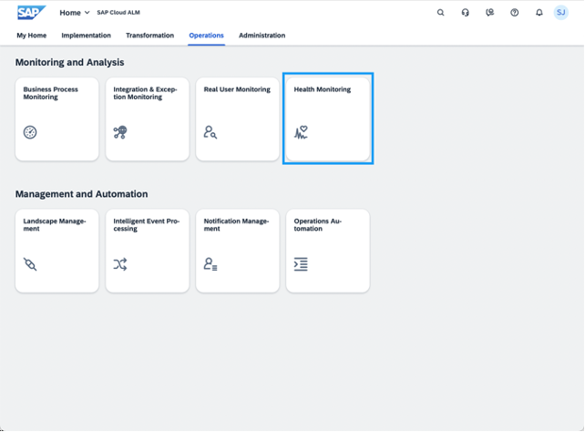
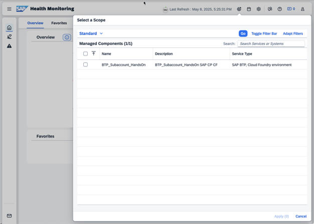

# Health Monitoring

In the Health Monitoring application, you can check the health of your monitored cloud service and technical systems from an application and customer perspective.

## Scope Selection and Home

- Open the Scope Selector

- Select Service “BTP_Subaccount_HandsOn” and apply your selection
 
Result: Based on your selection, you will see a card for services of the type “SAP BTP, Cloud Foundry environment” in the Overview area. 
 
## Explore Metrics

- Home
 
- Select Service Type “SAP BTP, Cloud Foundry environment”
 
- Select “BTP_Subaccount_HandsOn”
 
- Select Metric “Java Memory: Eden Space”
 
- Open History and analyse the trend

## Use In-App Help

- Starting Point Health Monitoring Home or also from other areas:
  
- Open In-App Help
  
- Result
 
 
**Next Step**
[Proceed to Cloud Logging](/exercises/ex1/1_HealthMonitoring_CloudLogging.md)

**Additional Links**
[Session Overview](/README.md#overview)
