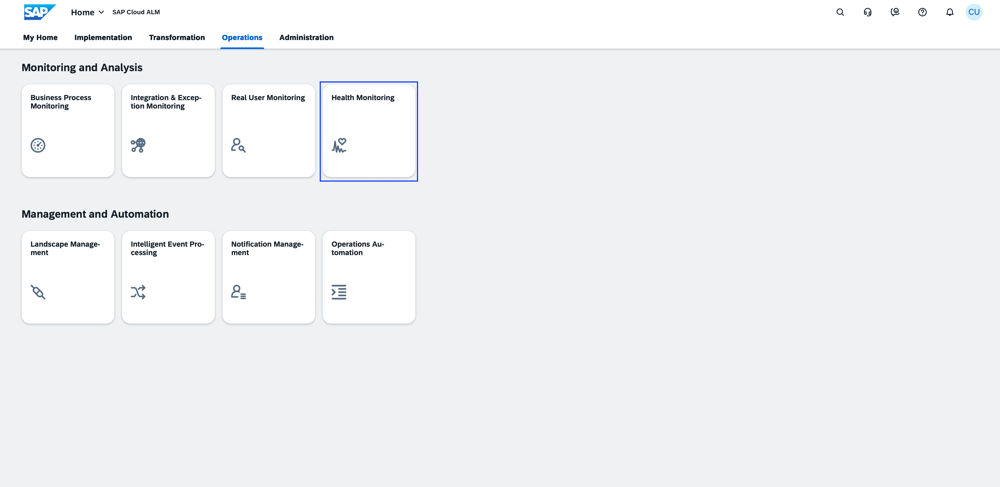
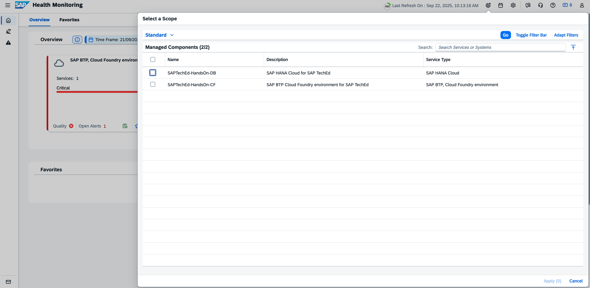
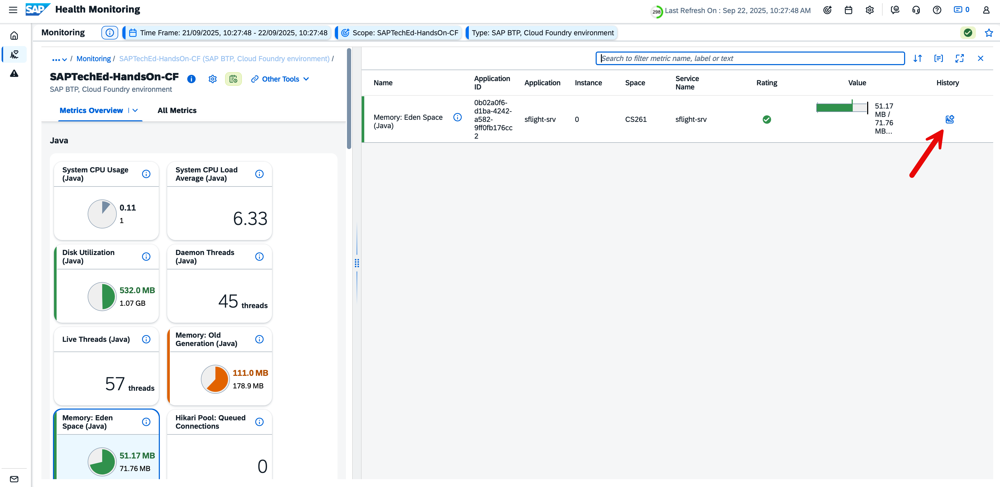
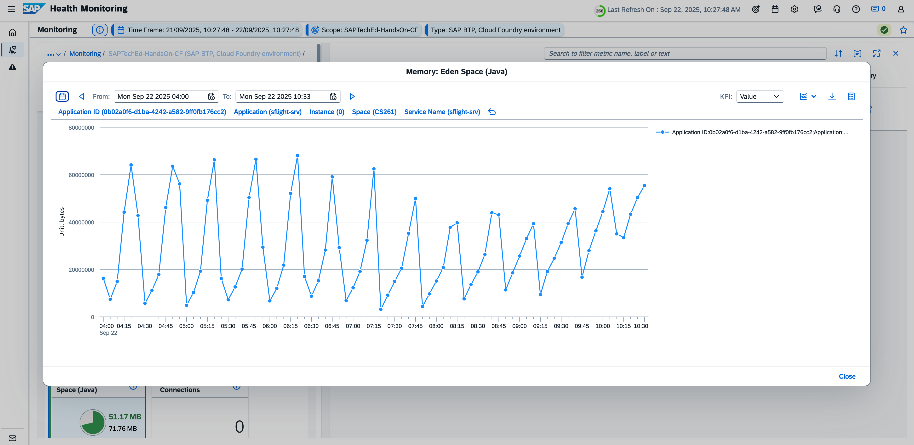
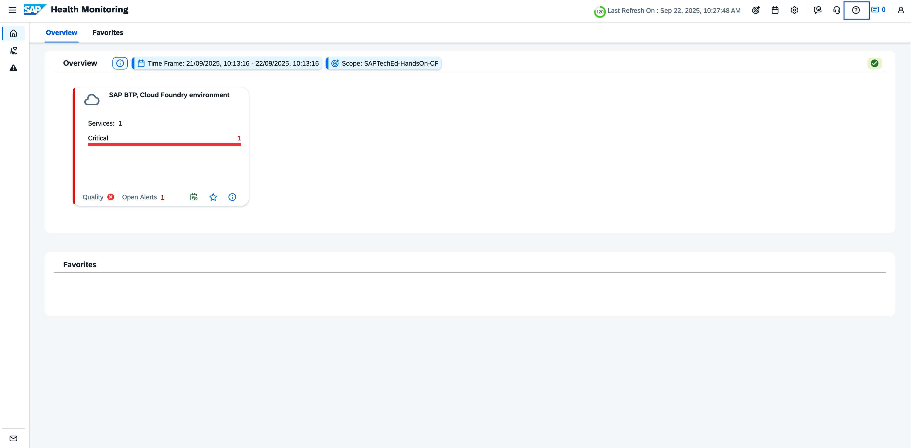
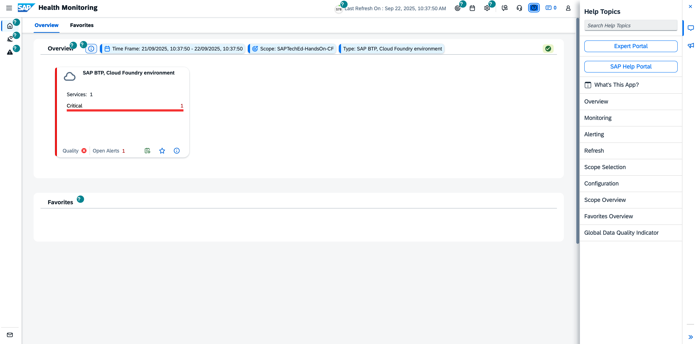

# Health Monitoring

In the Health Monitoring application, you can check the health of your monitored cloud service and technical systems from an application and customer perspective.

## Scope Selection and Home

- Open the Scope Selector

- Select Service “SAPTechEd-HandsOn-CF” and apply your selection

 
Result: Based on your selection, you will see a card for services of the type “SAP BTP, Cloud Foundry environment” in the Overview area. 

 
## Explore Metrics

- Home

- Select Service Type “SAP BTP, Cloud Foundry environment”

 
- Select “SAPTechEd-HandsOn-CF”

 
- Select Metric “Memory: Eden Space (Java)”

 
- Open History and analyse the trend

## Use In-App Help

- Starting Point Health Monitoring Home or also from other areas:

  
- Open In-App Help

  
- Result

 
 

**Next Step**\
[Proceed to Cloud Logging](/exercises/ex1/1_HealthMonitoring_CloudLogging.md)

**Additional Links**\
[Session Overview](/README.md#overview)
