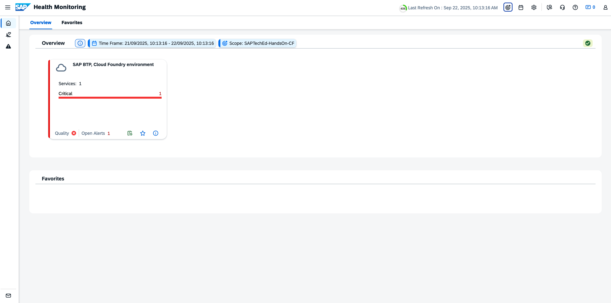
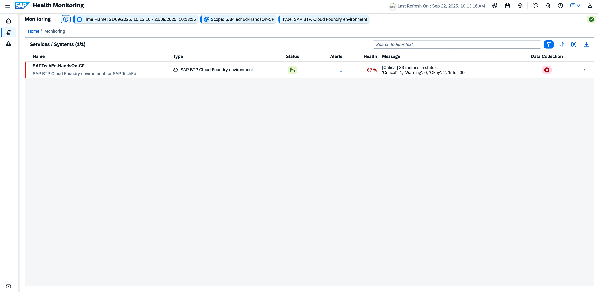
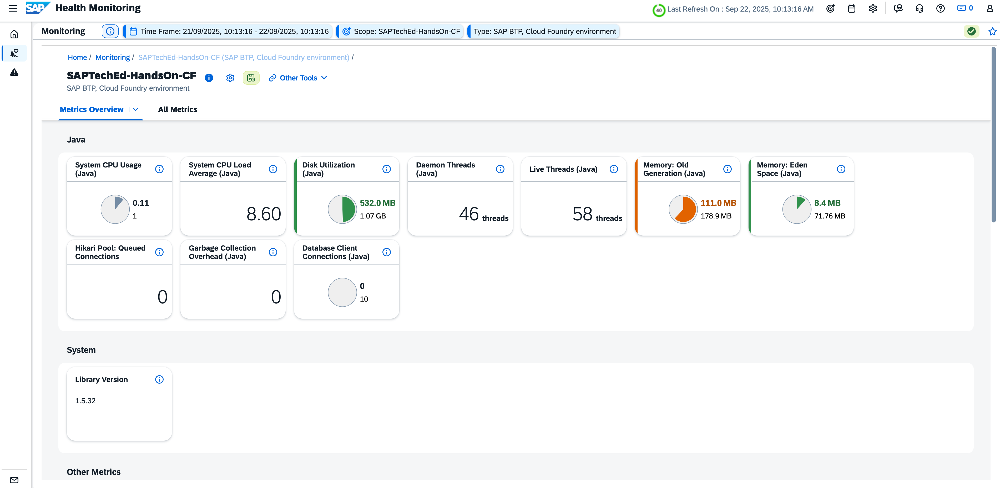
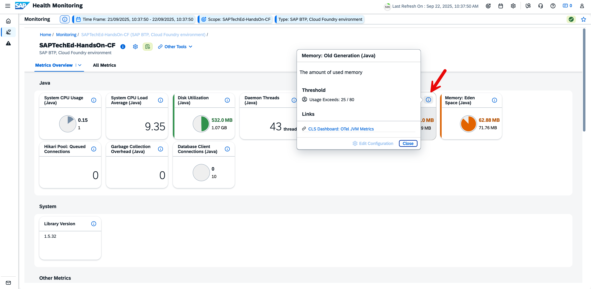
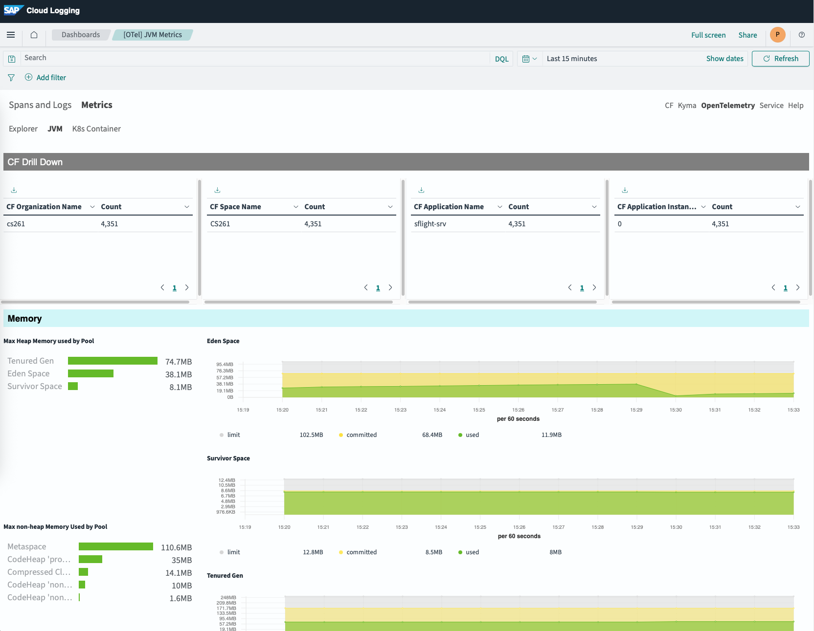
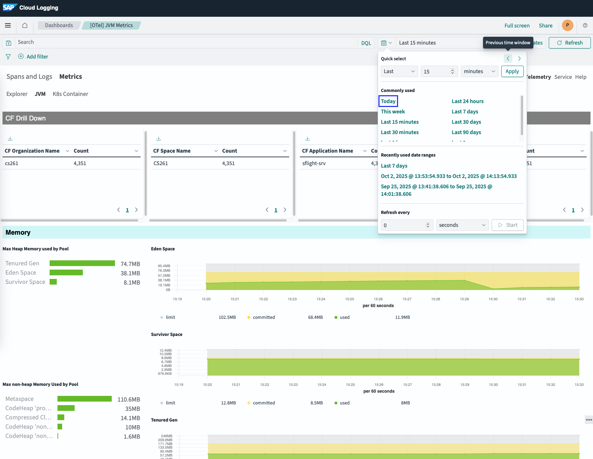
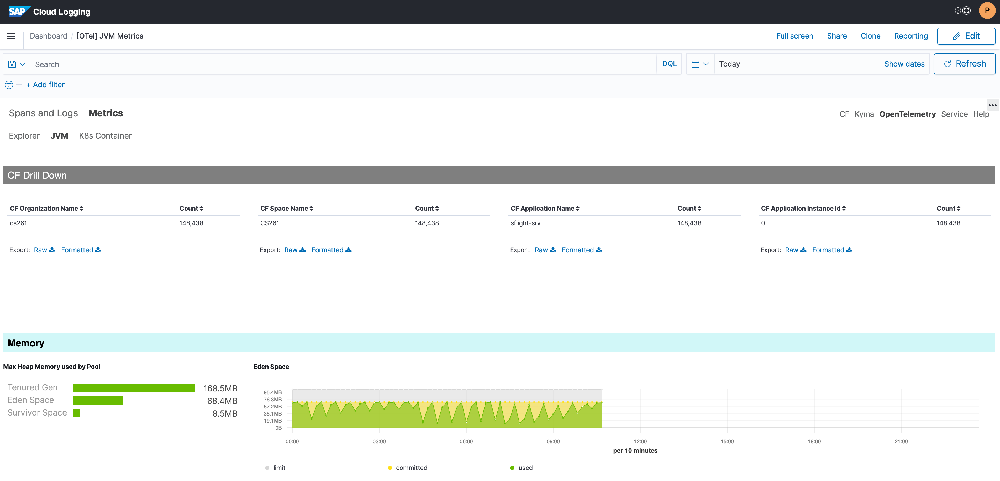

# Navigate to SAP Cloud Logging

- Home\

- Select Service Type “SAP BTP, Cloud Foundry environment”\

- Select “SAPTechEd-HandsOn-CF”\

- Select Metric "Memory: Old Generation (Java)" and click on information\

- Select “CLS Dashboard: OTel JVM Metrics”\

- Sign In to SAP Cloud Logging (account see chapter Cloud Identity Services)

- Result\

- Hint: In case being asked to select your tenant: Select “Global”, confirm and open the link again

- Adjust Time Window\

- Result\

**Next Step**\
[Continue to Exercises](/exercises/ex1/1_HealthMonitoring_Exercises.md)

**Additional Links**\
[Health Monitoring Overview](/exercises/ex1/1_HealthMonitoring_Base.md)\
[Session Overview](/README.md#overview)