## Health Monitoring Solutions

## 1.1 Adjust Time Frame
- Follow the steps until opening the History of the metric "Memory: Eden Space (Java)"

- Open Time Frame Selection
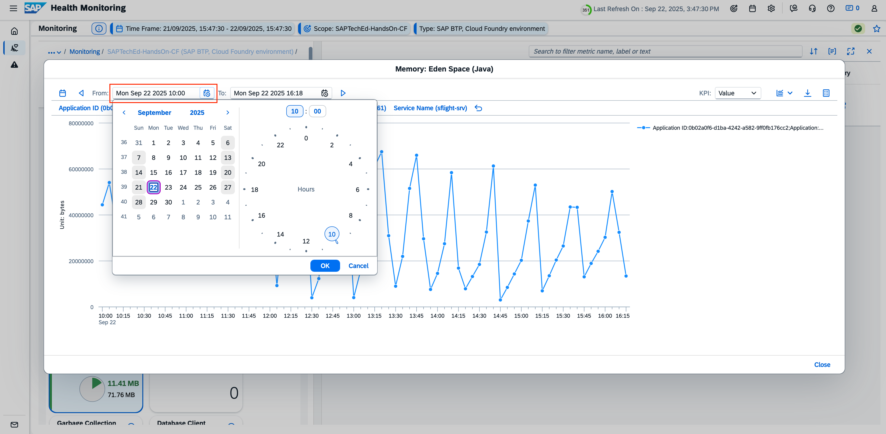

- Pick a date that is a few days on the past
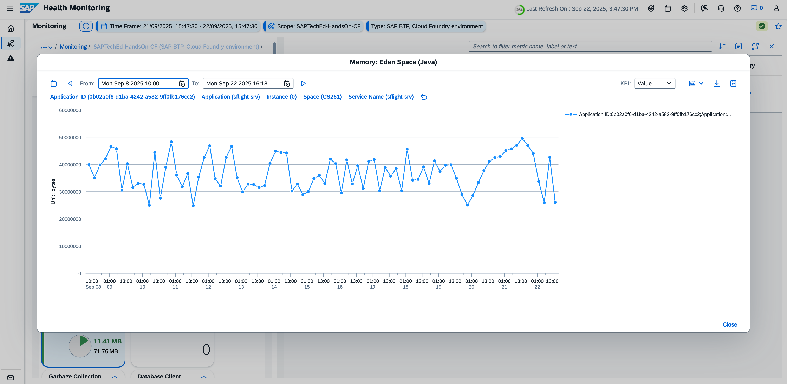

## 1.2 Adjust Resolution
- Open Time Frame 
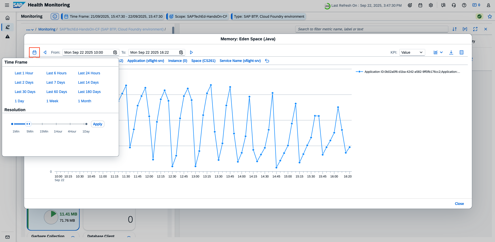

- Adjust Resolution with the slides to “15Min” and apply changes
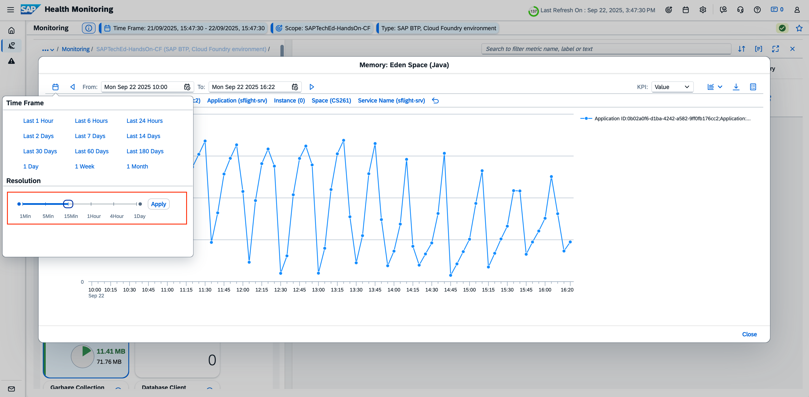

- Result
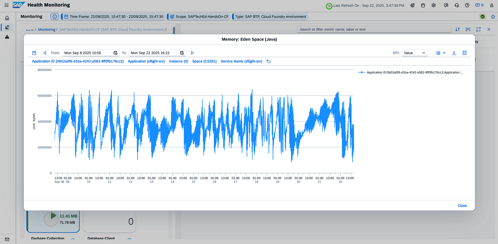

## 1.3 Which library version is used by the custom app
- Navigate to metric “Library Version”
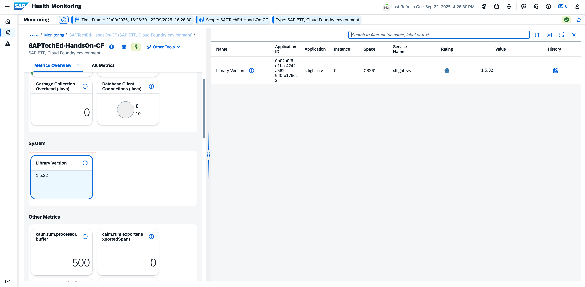

- The version is shown on the tile itself and in metric details.
In case there are multiple apps running in the environment, check the metric details.

## 1.4 Check which Event and Alerts are configured
- Home

- Open Configuration Panel and click on Service “SAPTechEd-HandsOn-CF”:
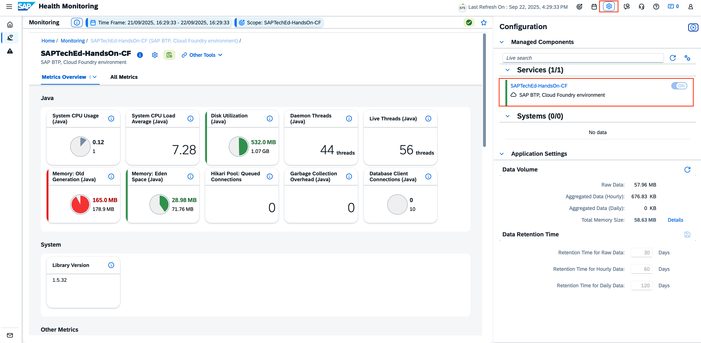

- Configuration for Services
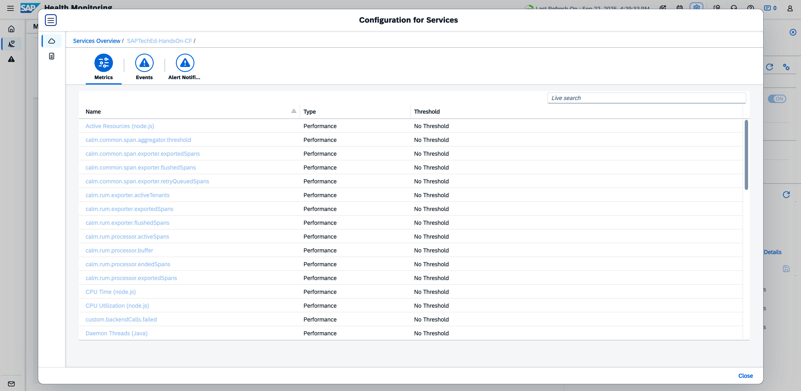

- Navigate to Events
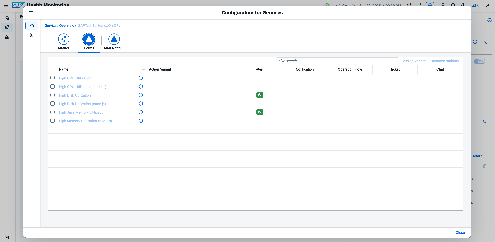

- **Result** 
Alert are active for “High Disk Utilization”, and “High Java Memory Utilization”

## 1.5 Add Service to Favorites
- Navigate to the Metric Overview of the Service “SAPTechEd-HandsOn-CF”

-  Click on “Favorite” Icon

- Navigate to Home and see the results in the favorite section
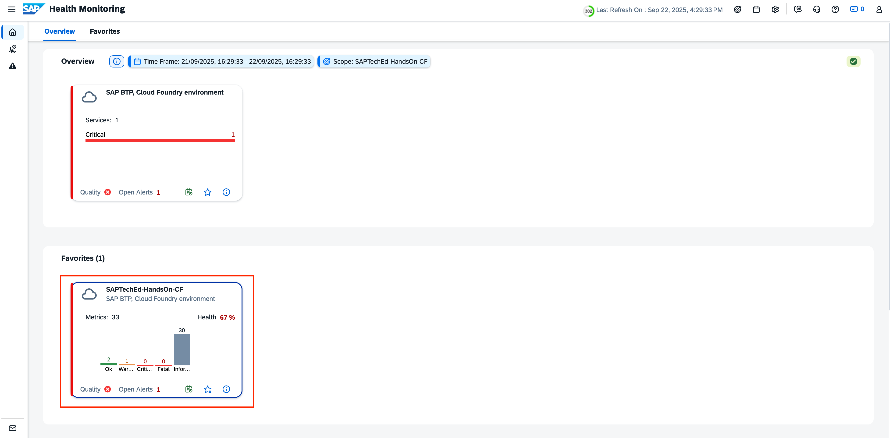

## 1.6 Explore Whats's New
-  Open the In-App Help and Navigate to the What's New area
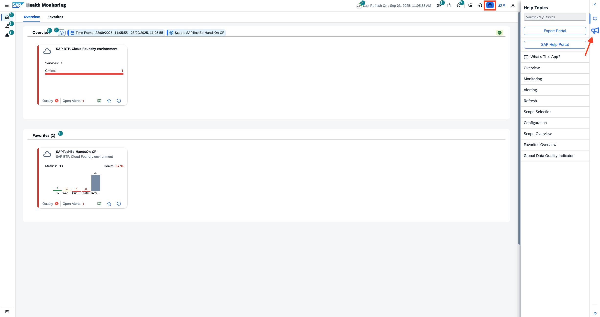

- **Result**
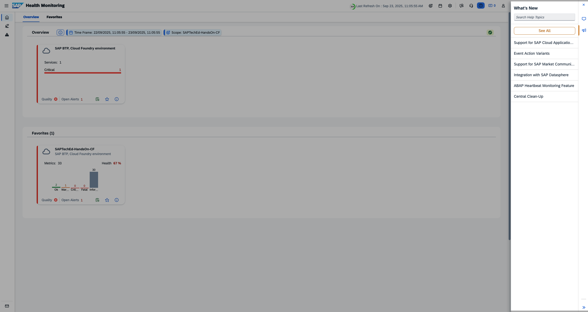

## 1.7 In App Help Use Spots
- Open the In-App Help and click on a certain spot (example: Scope Overview)
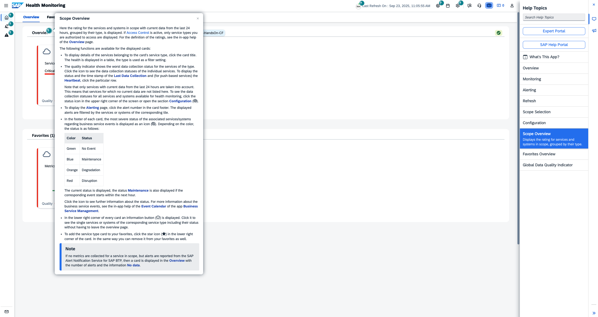

## 1.8 Adjust Time Window and explore exceptions raised for others traces
- Adjust the Time Window to see all data collected for “This Week”
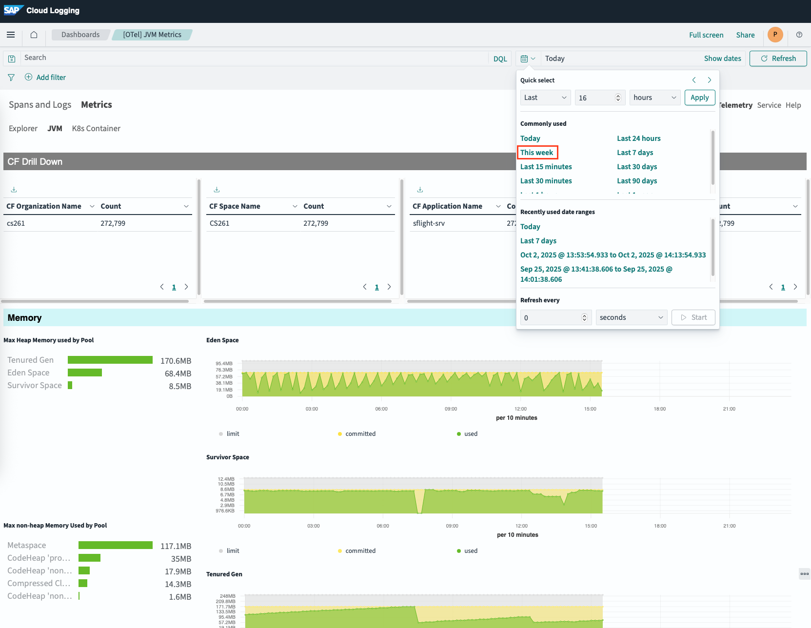

- **Result**
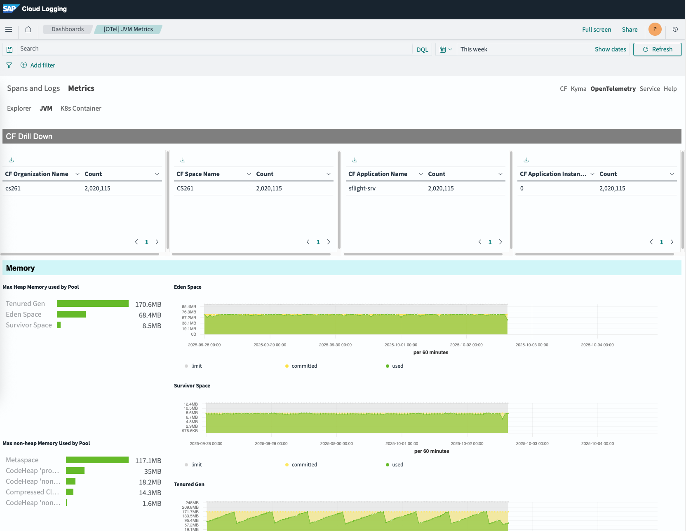

- Click on the filter starting with “traceId:” so see results across the resource
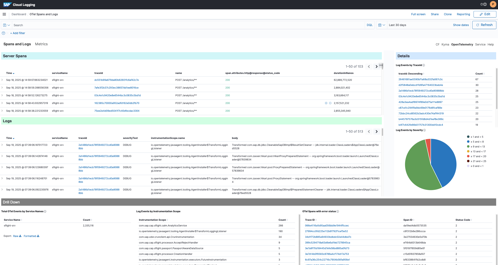

**Next Step**\
[Integration and Exception Monitoring Overview](/exercises/ex2/2_ExceptionMonitoring_Base.md)

**Additional Links**\
[Health Monitoring Overview](/exercises/ex1/1_HealthMonitoring_Base.md)\
[Health Monitoring Exercises](/exercises/ex1/1_HealthMonitoring_Exercises.md)\
[Session Overview](/README.md#overview)
