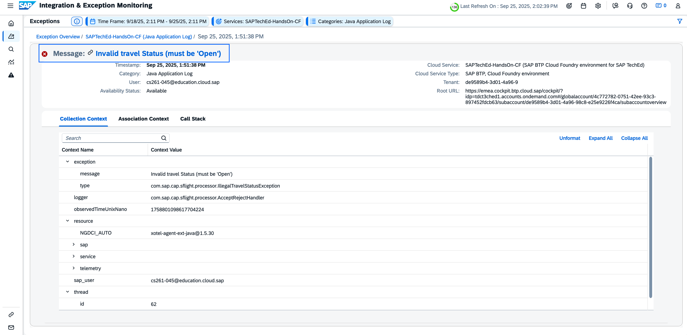
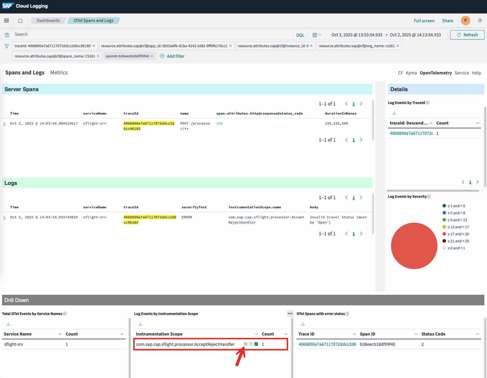
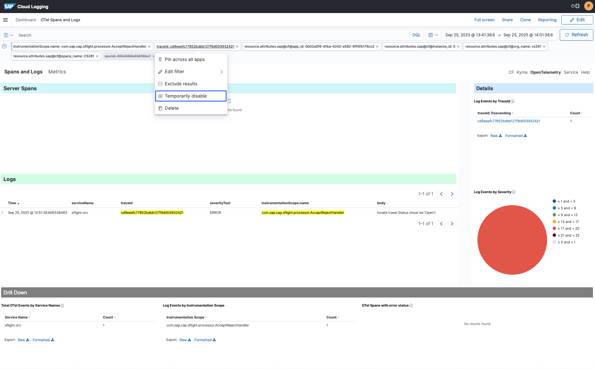
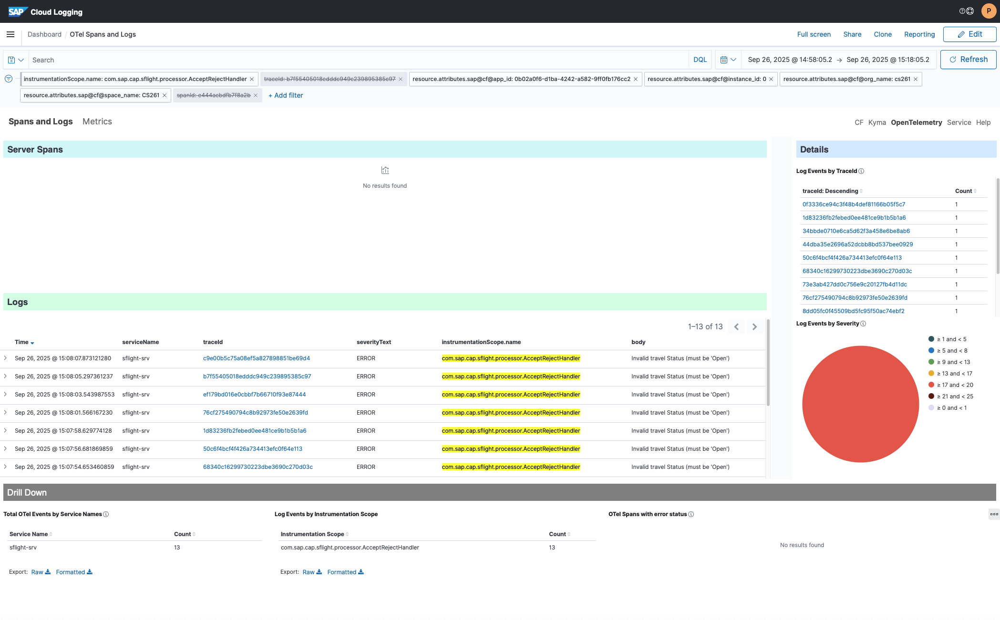

# Exercises: Integration and Exception Monitoring 

# 2.1 Adjust Time Window and explore exceptions raised for other traces (Guided Exercise)

-  Click on Exception Message (link: “Invalid travel Status (must be ‘Open’)”)

- Add filter "com.sap.cap.sflight.processor.AcceptRejectHandler" by hovering and clicking on "+"

- Disable "traceid" from the filter. Click on "traceid" and select "Temporarily disable"

- **Result**

**Next Step**\
[Continue to Real User Monitoring Overview](/exercises/ex3/3_RealUserMonitoring_Base.md)

**Additional Links**\
[Integration and Exception Monitoring Overview](/exercises/ex2/2_ExceptionMonitoring_Base.md)\
[Session Overview](/README.md#overview)

[SAP Cloud Logging (SAP Help Portal)](https://help.sap.com/docs/SAP_CLOUD_LOGGING)
