# Real User Monitoring

The purpose of Real User Monitoring is to provide transparency about the usage (executions) and the
performance (response times) of user interactions. It supports the monitoring request executions from
different platforms with a unified user experience using a common look-and-feel and handling pattern.
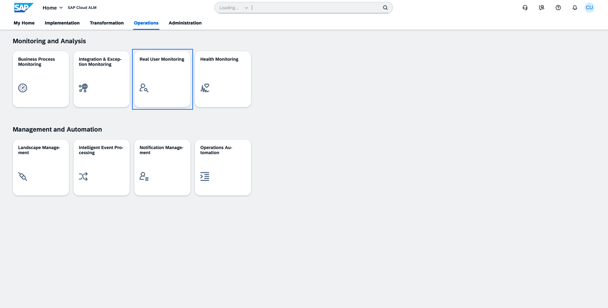

## Scope Selection and Home
- Open the Scope Selector
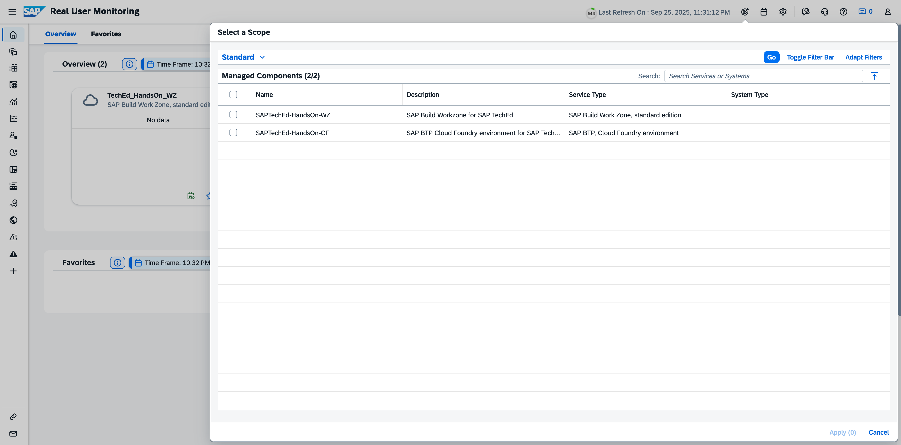

- Select both Services: Service "|service name|" and Apply your selection
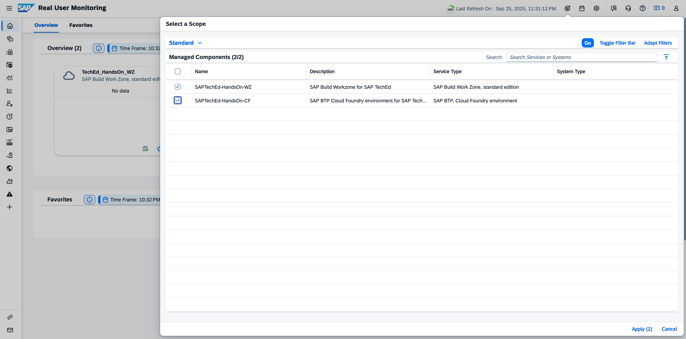

- **Result**: Based on your selection, you will see a card for services in the Overview area
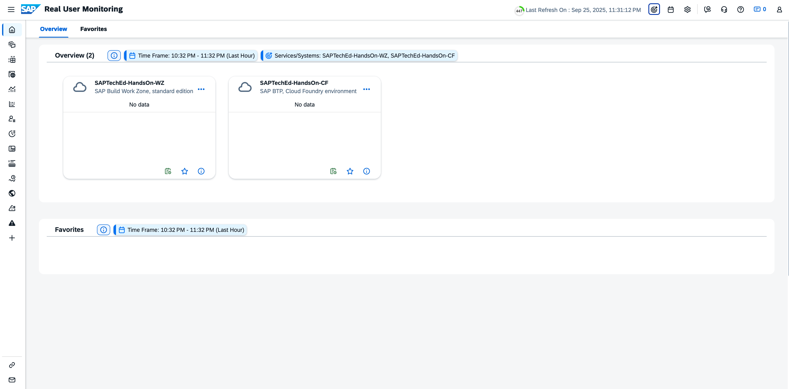

- **Info**: The default Time Frame is "Last Hour" - Data is always shown in context of the selected time frame. In the chapter [Time Frame](/exercises/ex2/2_ExceptionMonitoring_Base.md#Time-Frame), you will find example steps to adjust the time frame.

## Explore Requests 
- Home

- Navigate to Request Type "SAPUI5" in the SAP Build Work Zone, Standard Edition
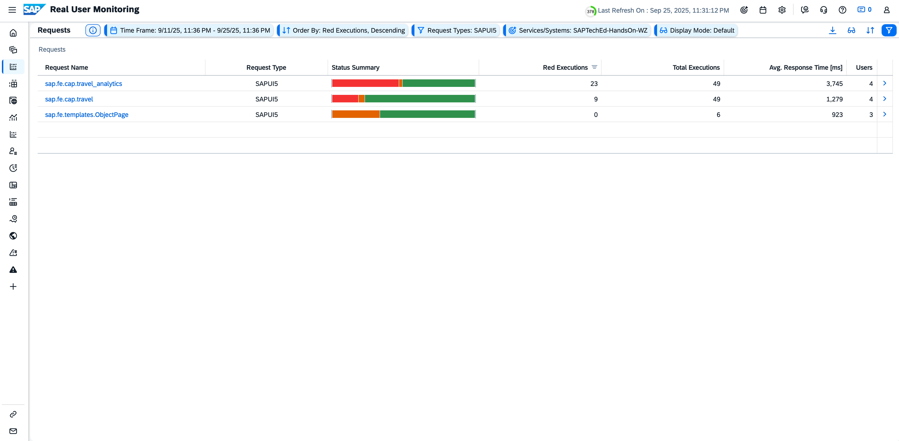

The next steps are an example to explore the details in the area of the customer application “Travel Analytics” and performance perceived from an end-user perspective

- Click on Request name "sap.fe.travel_analytics"

- Click on "KPI Tag"
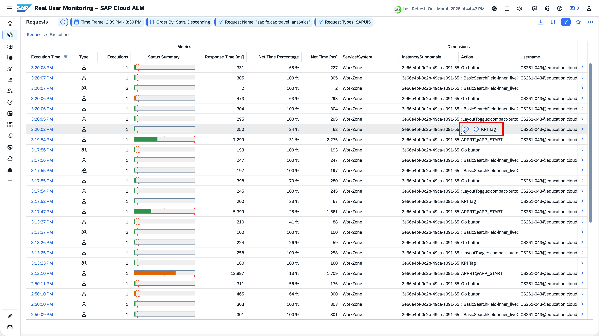

- Navigate to a specific execution
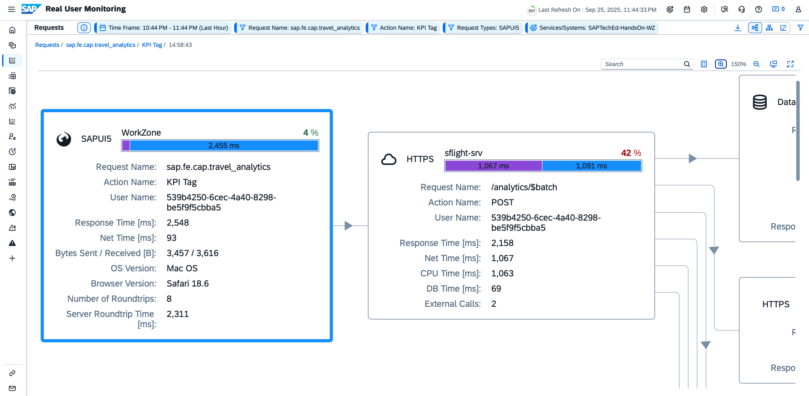

- Use Zoom
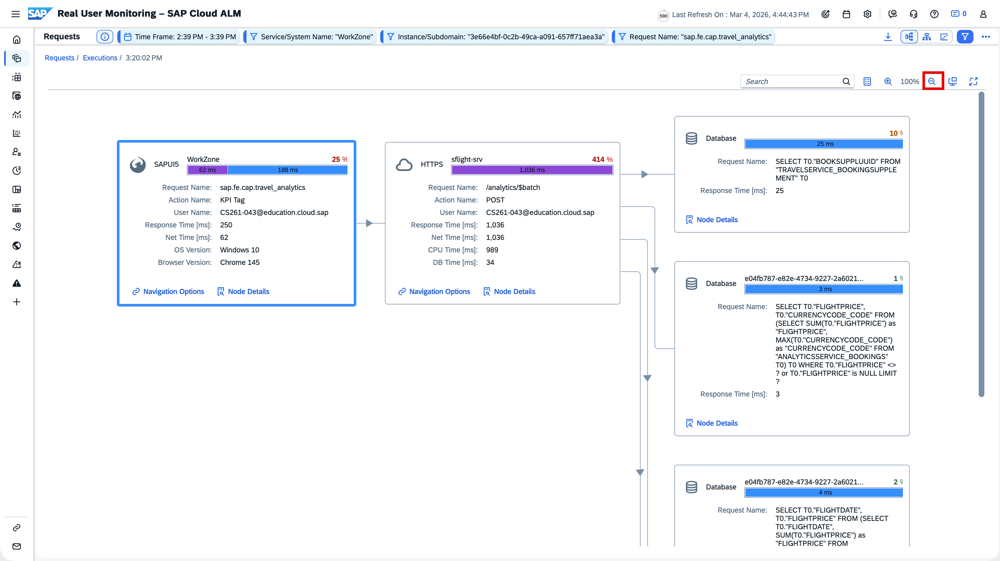

- Explore Details
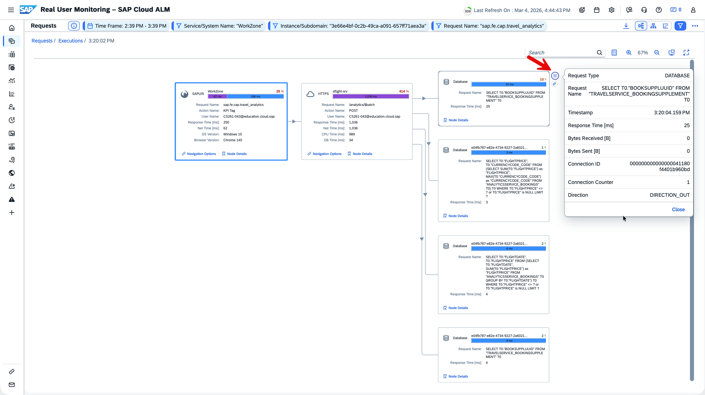

- Switch View and expand rows
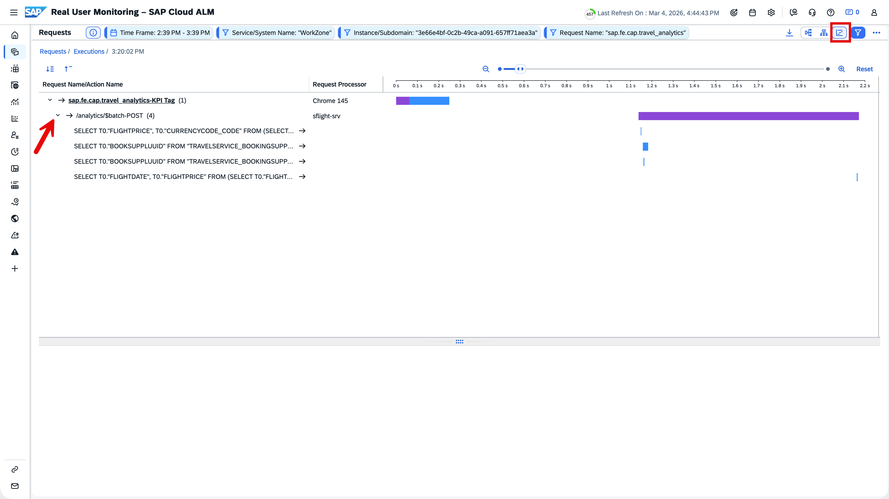

- Click the rows to see details per request
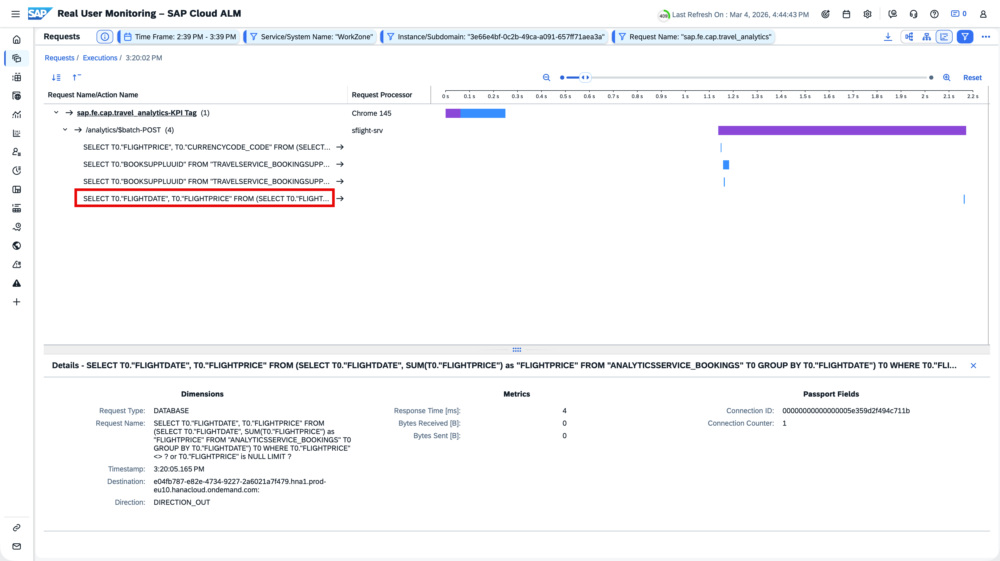

## (optional) Checkout available pages

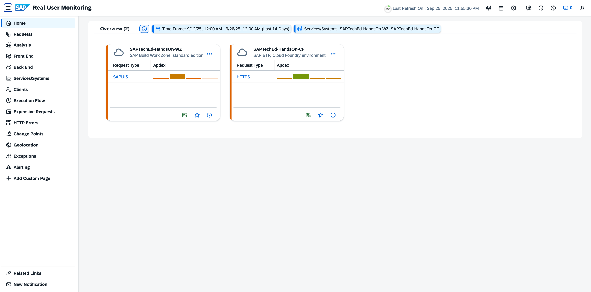

**Next Step**\
[Proceed to Cloud Logging](/exercises/ex3/3_RealUserMonitoring_CloudLogging.md)

**Additional Links**\
[Session Overview](/README.md#overview)
