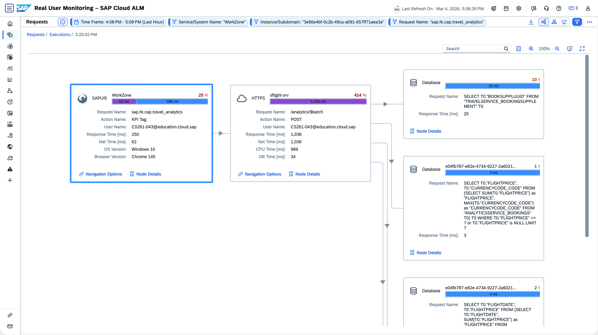
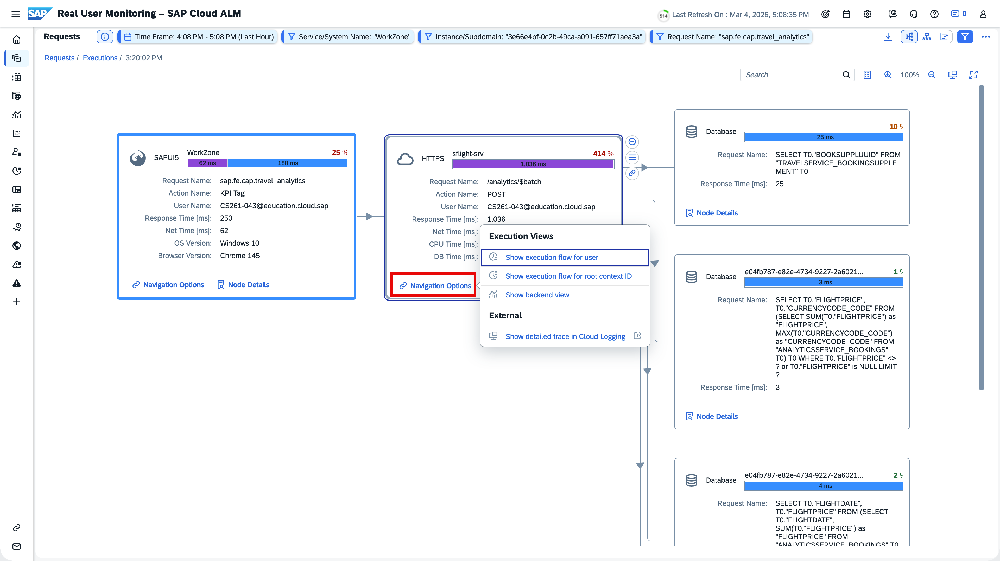
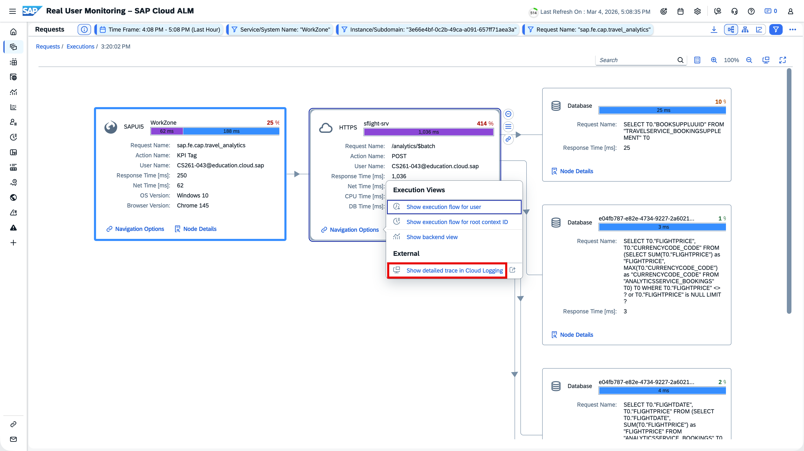

# Navigate to Cloud Logging

- Navigate to request details [Refer](3_RealUserMonitoring_Base.md#explore-requests) 

- Open Navigation Links for HTTPS request “sflight-srv”.
  Hint: The context menu is avaialble once the box is selected (active focus)

- Navigation Links

- Sign In to SAP Cloud Logging (account see chapter Cloud Identity Services)

- **Result**: Show detailed trace in Cloud Logging

Hint: In case your traceid cannot be opened - select a previous execution or check back in a few minutes. 

**Next Step**\
[Continue to Exercises](/exercises/ex3/3_RealUserMonitoring_Exercises.md)

**Additional Links**\
[Real User Monitoring Overview](/exercises/ex3/3_RealUserMonitoring_Base.md)\
[Session Overview](/README.md#overview)
