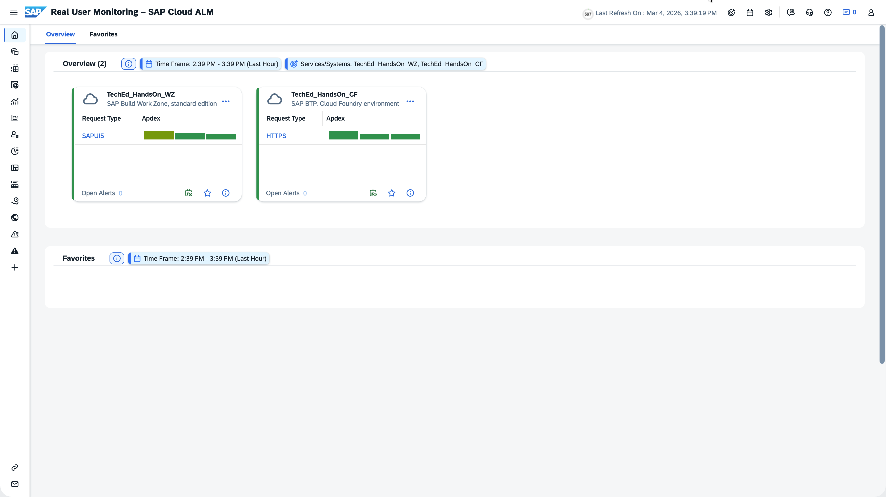
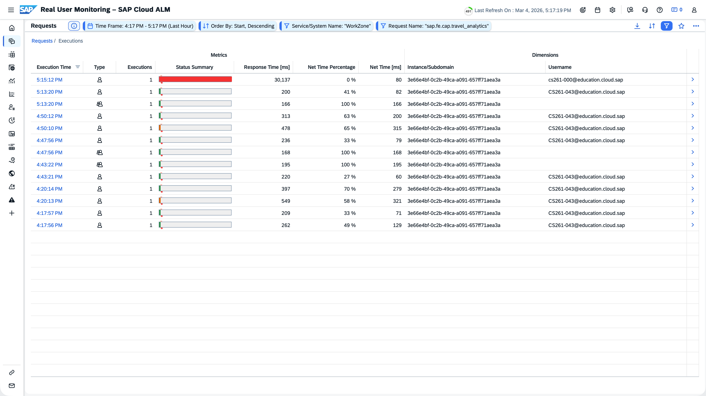
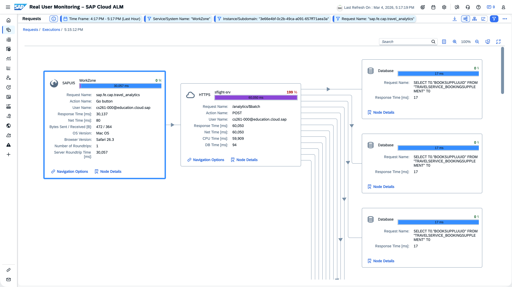
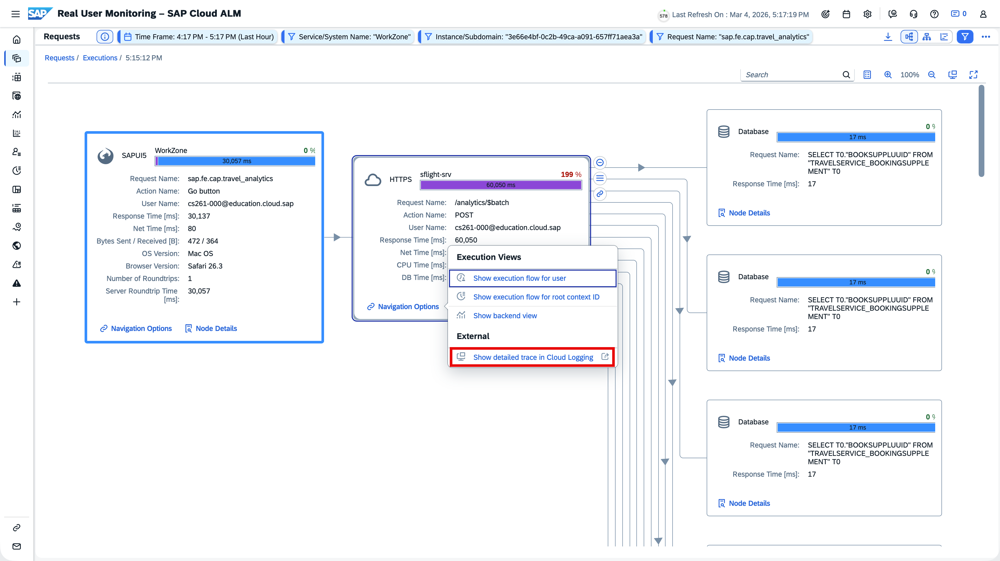
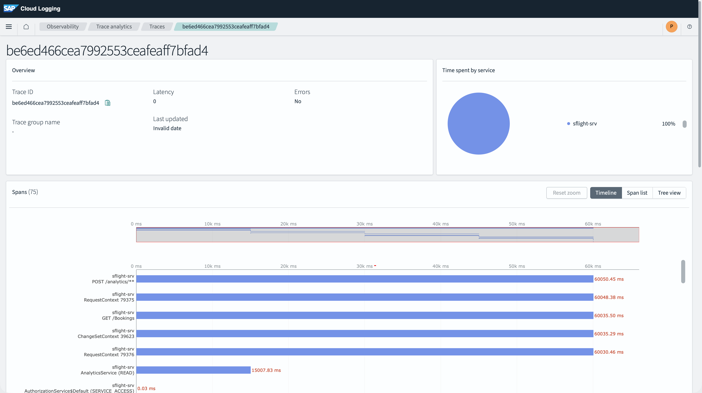
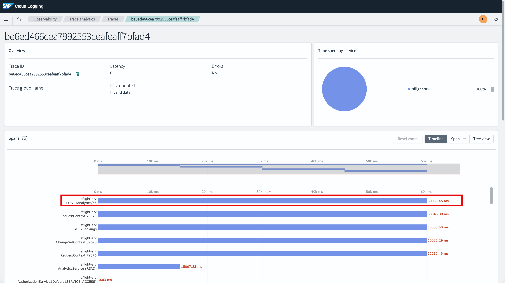

# Real User Monitoring Exercises

**Info:** There are two types of exercises: "Use what you learnt", where you can apply what you previously learnt, and guided exercises. 
The solution for the "Use what you learnt" exercise is linked at the end of the page. 

## 3.1 Front End Analysis
Figure out which Front Ends are used most often. Have a look on Operations Systems and Web Browser

## 3.2 Check out Related Links
Explore the Related Links area and check out the links provided

## 3.3 Timeout Error Root Cause Analysis
Analyze the time out issue being shown by the instructor and figure out the root cause

- Home

- Navigate to Requests (New)
.png>)

- Adjust dimensions

- Select “Request Name”, “Request Type”, and “Action”

- Close. The table should be updated according to the selected "Dimensions"

- Select Request with Action “Go button”
 

- Execution List

- Select the relevant execution to navigate to the details

- Open Navigation Options and “Show detailed trace in Cloud Logging”

- Trace details in SAP Cloud Logging

- Explore spans to learn more about the request content

## 3.4 Creating a Custom Page (Guided Excercise)
- Open the side navigation menu
- Click on the "Add Custom Page" button at the bottom of Page List 

- Select Views and Drag it to the Page

- Provide and Name and an Icon for the Page in the "Page Management" panel

- Save the Page

- **Result**\
You can see that the newly added Page appears on the Page List and will be available on subsequent revisits

- **Note**\
As an **Admin** - **which you are not** - you can also share custom pages with other users

**Next Step**\
[Refer to the Solutions](/exercises/ex3/3_RealUserMonitoring_Solutions.md)\
[Continue to Business Process Monitoring Overview](/exercises/ex4/4_BusinessProcessMonitoring_Base.md)

**Additional Links**\
[Real User Monitoring Overview](/exercises/ex3/3_RealUserMonitoring_Base.md)\
[Session Overview](/README.md#overview)
