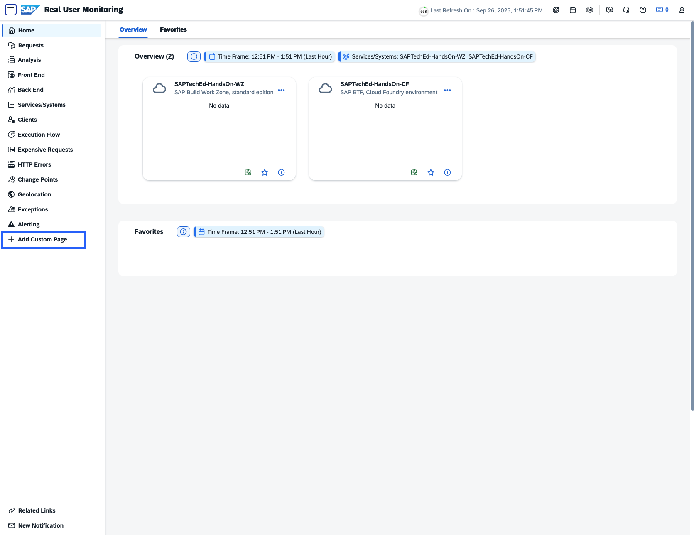
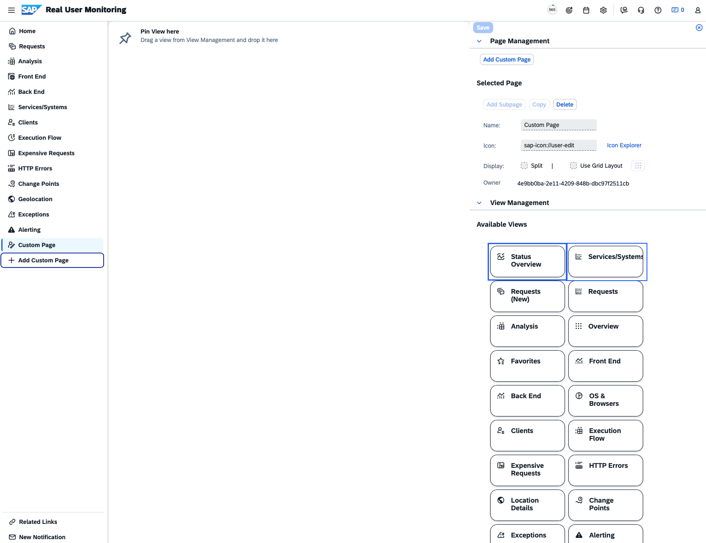
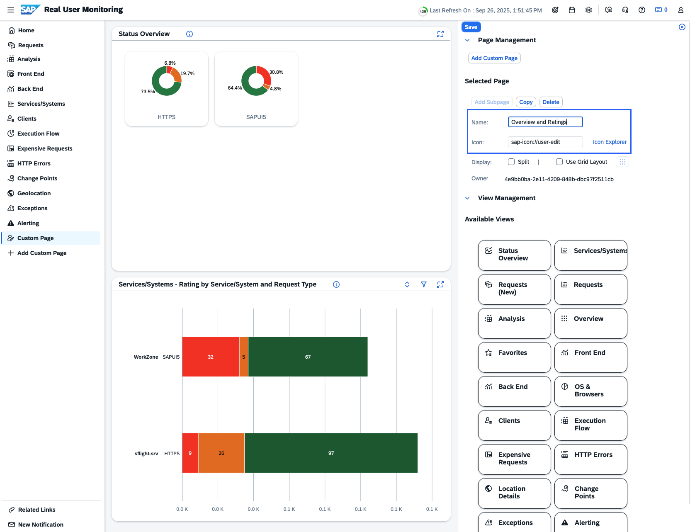
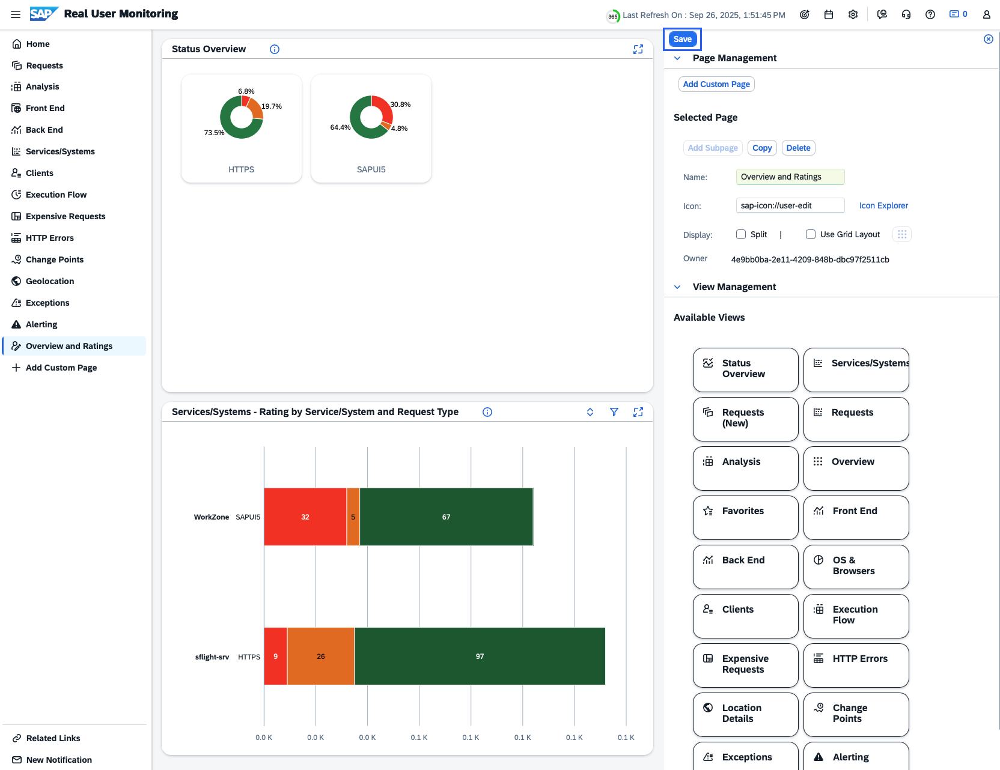
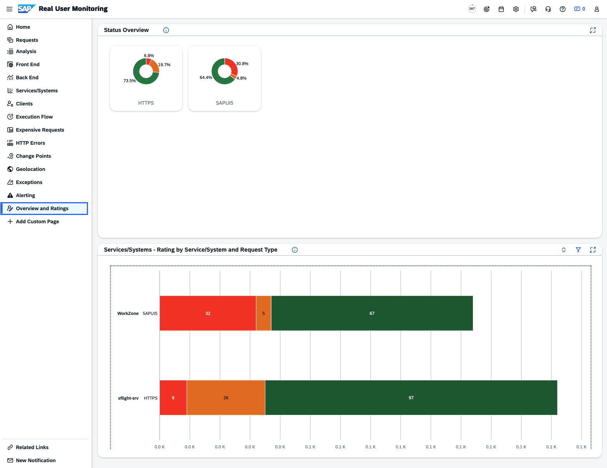
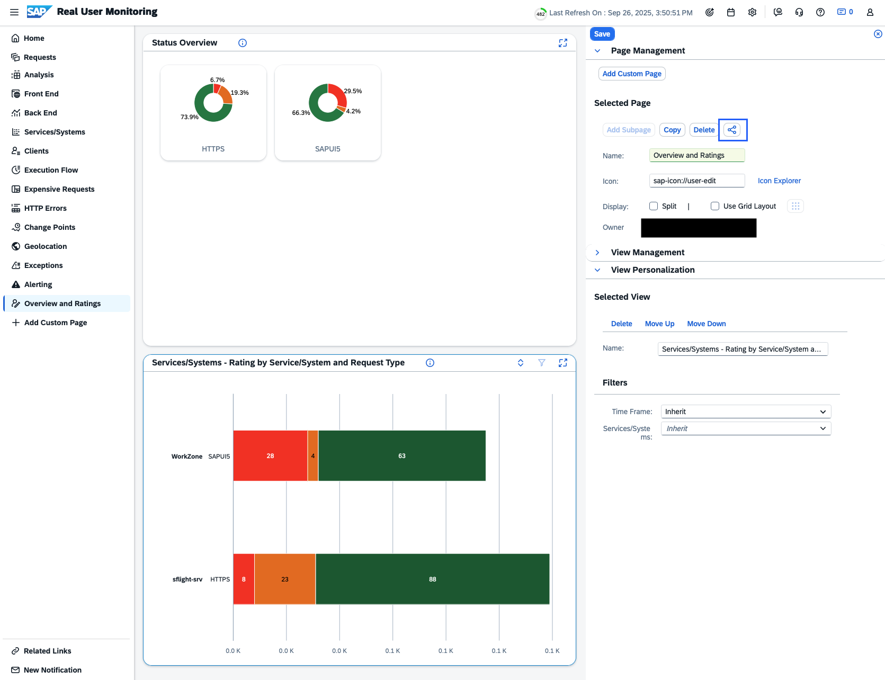

# Real User Monitoring Exercises

## 3.1 Front End Analysis
Figure out which Front Ends are used most often. Have a look on Operations Systems and Web Browser

## 3.2 Check out Related Links
Explore the Related Links area and check out the links provided

## 3.3 Timeout Error Root Cause Analysis
Analyze the time out issue being shown by the instructor and figure out the root cause

## 3.4 Creating a Custom Page (Guided Excercise)
- Click on the "Add Custom Page" button at the bottom of Page List 

- Select Views and Drag it to the Page

- Provide and Name and an Icon for the Page

- Save the Page

- **Result**\
You can see that the newly added Page appears on the Page List and will be available on subsequest revisits

- **Note**\
Additionally, as an **Admin**, it is also possible to share custom pages with other users

**Next Step**\
[Refer to the Solutions](/exercises/ex3/3_RealUserMonitoring_Solutions.md)\
[Continue to Business Process Monitoring Overview](/exercises/ex4/4_BusinessProcessMonitoring_Base.md)

**Additional Links**\
[Real User Monitoring Overview](/exercises/ex3/3_RealUserMonitoring_Base.md)\
[Session Overview](/README.md#overview)
