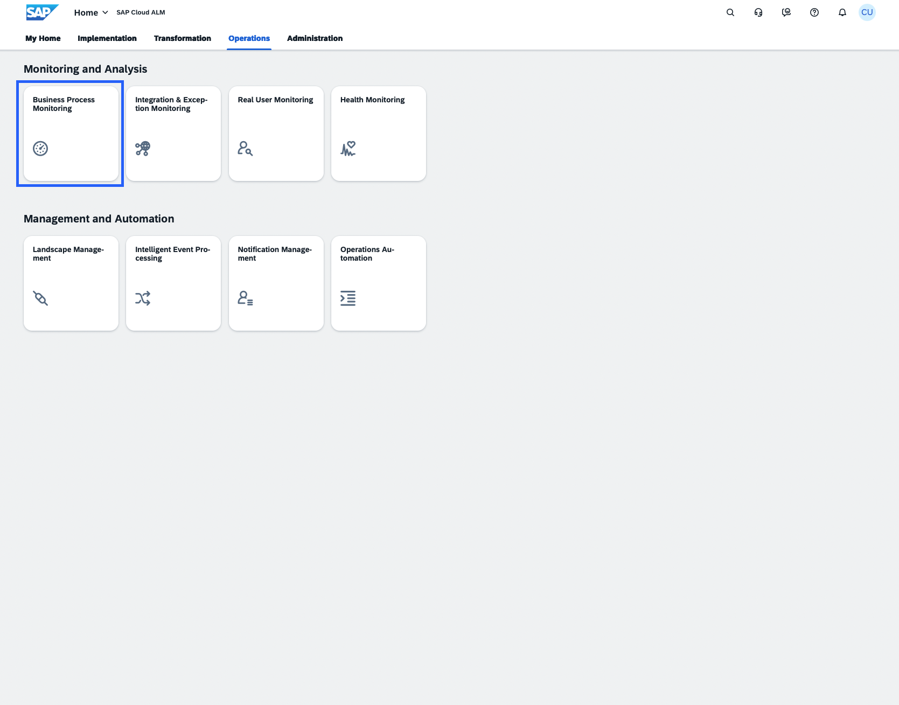
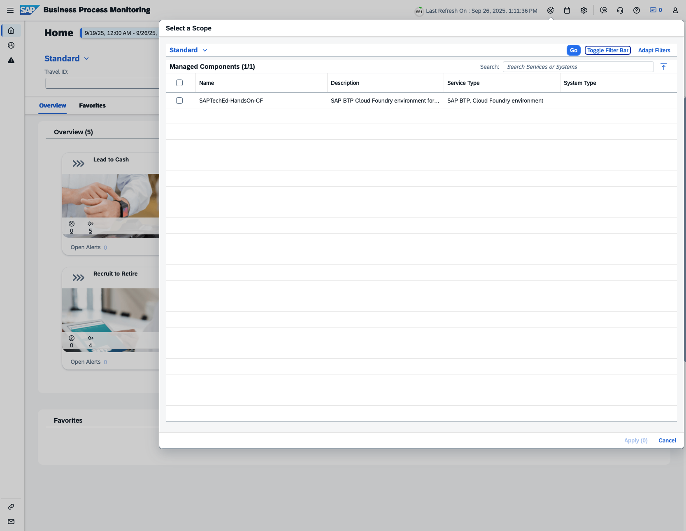
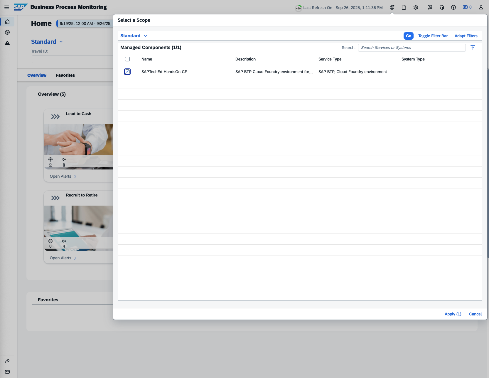
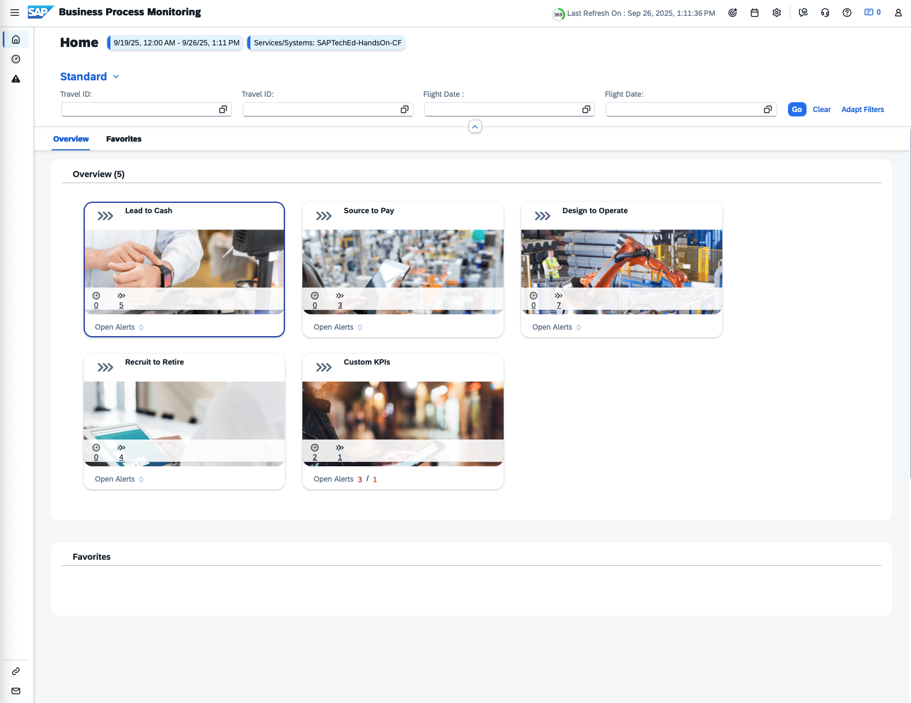
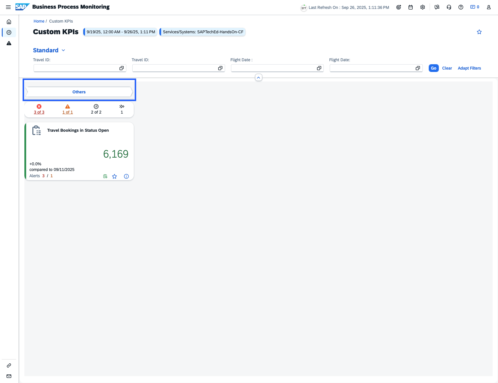
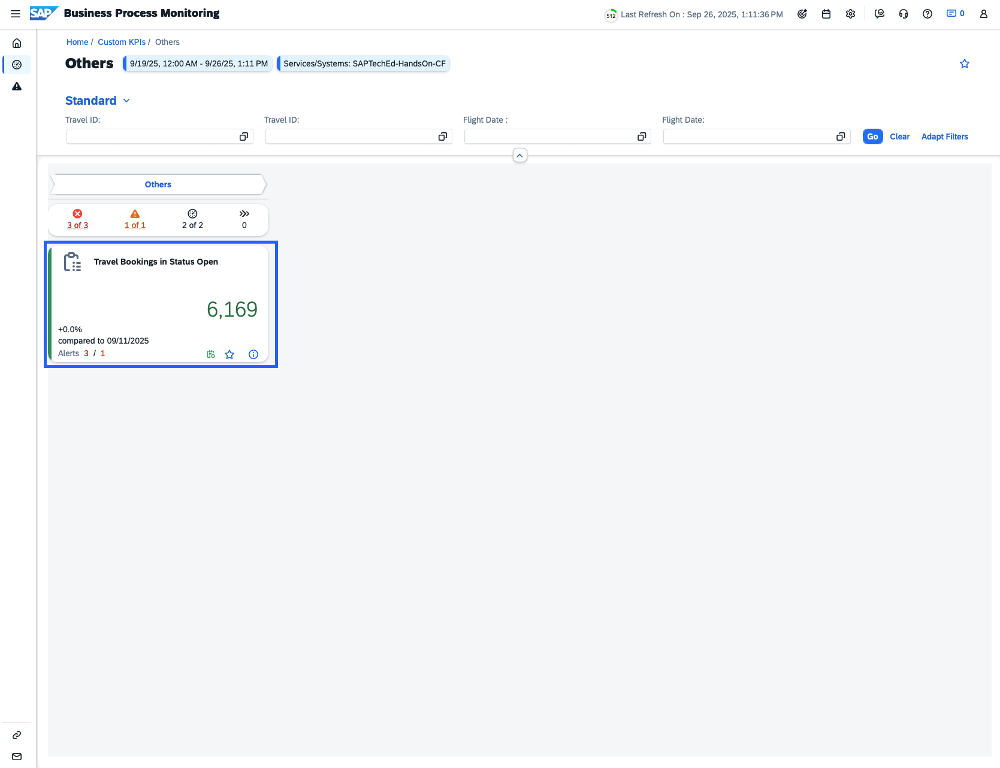
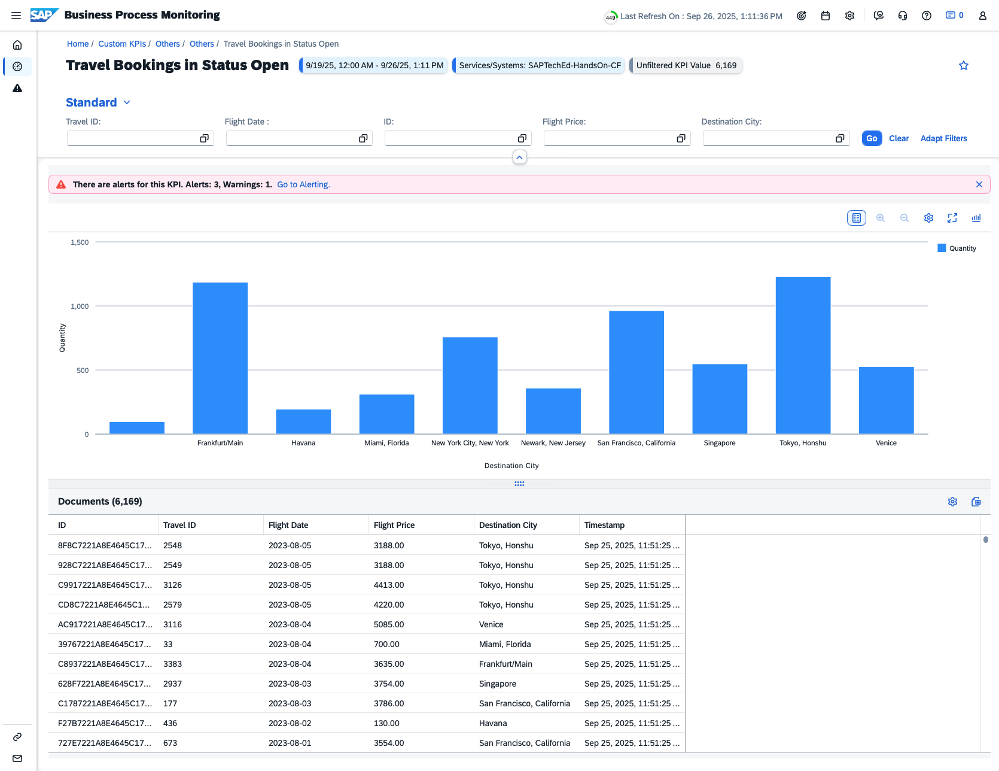

# Business Process Monitoring

[Link to SAP Cloud ALM tenant](https://cs261-n5i2x9xc.eu10-004.alm.cloud.sap/launchpad#Shell-home)

## Scope Selection and Home

- Open the Scope Selector

- Select “SAPTechEd-HandsOn-CF”, Service Type “SAP BTP, Cloud Foundry environment”

- In case "SAPTechEd-HandsOn-CF is not shown - change the Filter for Managed Components, select “Service” and press “Go”

- Apply your selection

- **Result**: Based on the selected scope, the relevant data in KPIs is shown. In the Overview Area, you can see pre-delivered processes as well as the Custom KPIs process.

## Navigation within KPIs based on Custom KPI

- Home

 
- Select process "Custom KPI"
 

- Select “Others” 

- Click on the KPI "Travel Bookings in Status Open"

- **Result**\
KPI Details

- **Information**\
Please continue with the [exercises](/exercises/ex4/4_BusinessProcessMonitoring_Exercises.md) to create your own Custom KPI. As part of the exercise, you will have the opportunity to define an event, adjust the graph, work with views, and explore further capabilities. 

**Next Step**\
[Continue to Exercises](/exercises/ex4/4_BusinessProcessMonitoring_Exercises.md)

**Additional Links**\
[Session Overview](/README.md#overview)
