# Business Process Monitoring Exercises

Disclaimer: These tasks contain the relevant steps - the relevant solutions are embedded.

## 4.1 Create your Custom KPI (Guided Exercise)

- Open 'Configuration' section, navigate to 'KPI Management', and Click on 'Configure KPI' button
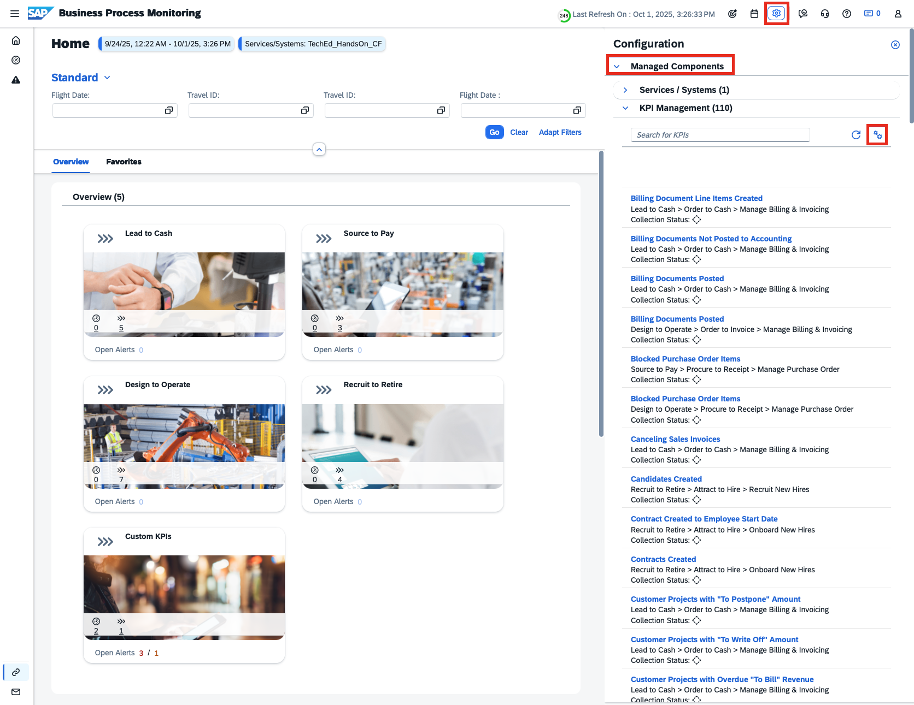

- Click on the 'Create Custom KPI' button placed on the toolbar of the KPIs table
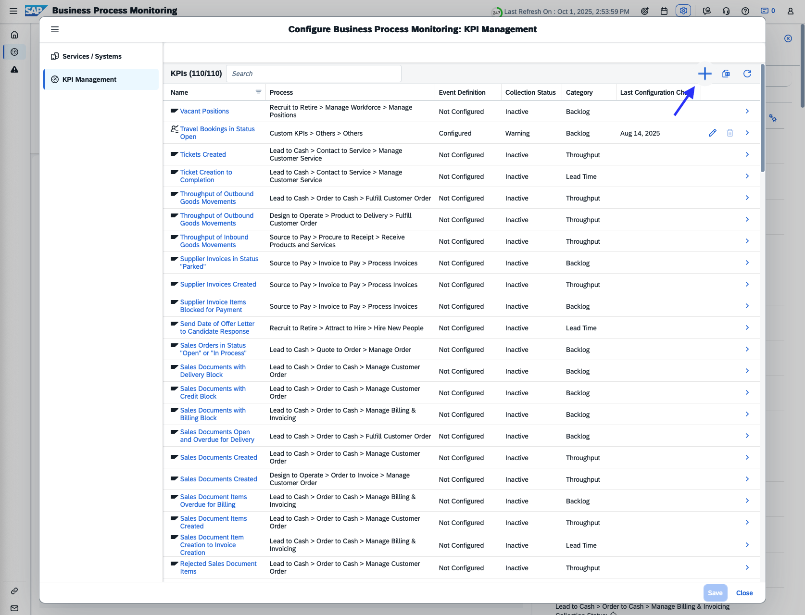

- Configure your Custom KPI. Fill all Mandatory fields
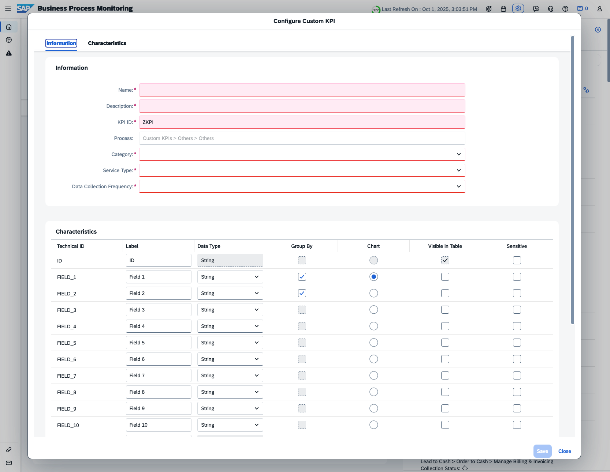

- Refer to the section below to configure the KPI. **Please follow the naming convention as suggested** \
**Replace XX with your Participant Number**  
    - Name: **XX** - Open Travel Bookings
    - Description: Travel Bookings with Status Open - Participant **XX**
    - KPI ID: ZKPITBP0**XX**
    - Category: Backlog
    - Service Type: SAP BTP, Cloud Foundry environment 
    - Data Collection Frequency: 15 minutes \
    - **Fill out the Characteristics section as shown below
    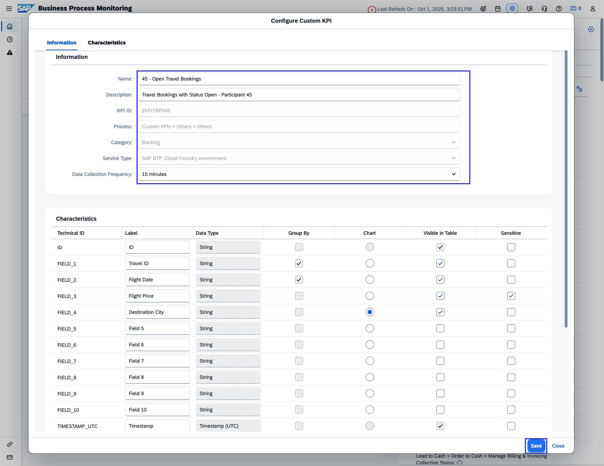

- Close the Custom KPI
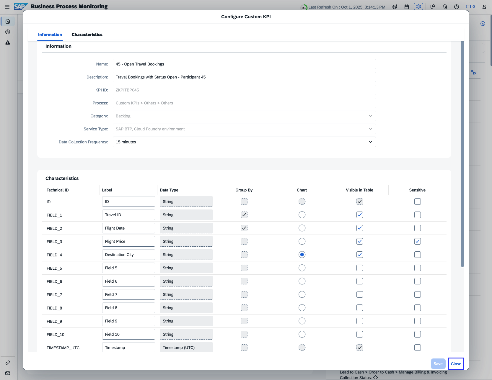

- Check the KPI listed in the KPIs table
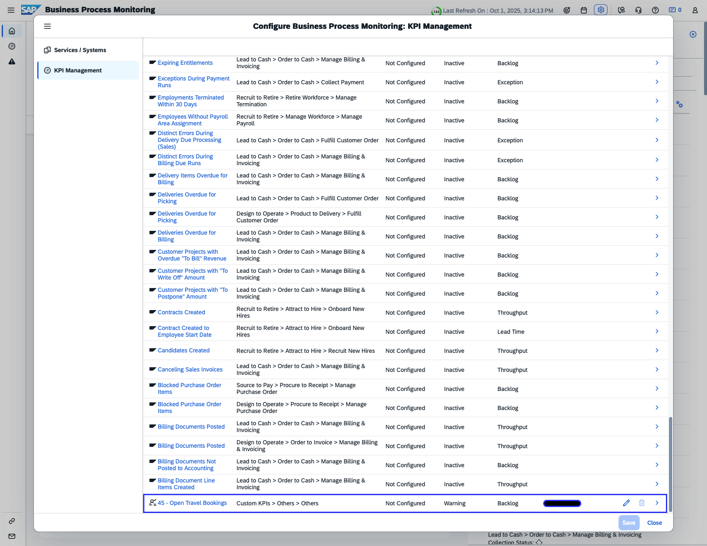

## 4.2 Check Data Collection (Guided Exercise)
- Contact instructors to trigger Data Collection.
- Open 'Configuration' section, navigate to 'KPI Management'. Check the Collection Status of the KPI
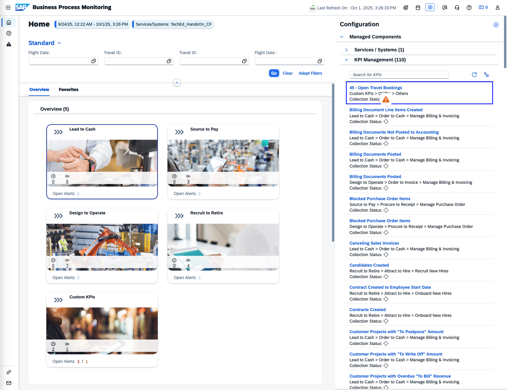

** Show Data Collection being switched on in KPI Management > KPI Management > Click on KPI > Data Collection Tab (check if the data collection is switched on, if not switch the data collection on for you KPI)

** Inform the instructor so that the data collection run is triggered

## 4.3 Create an Event to be alerted (Guided Exercise)
In order to get alerted based on certain conditions, an Event needs to be configured

- Navigate to the KPI created in the previous section
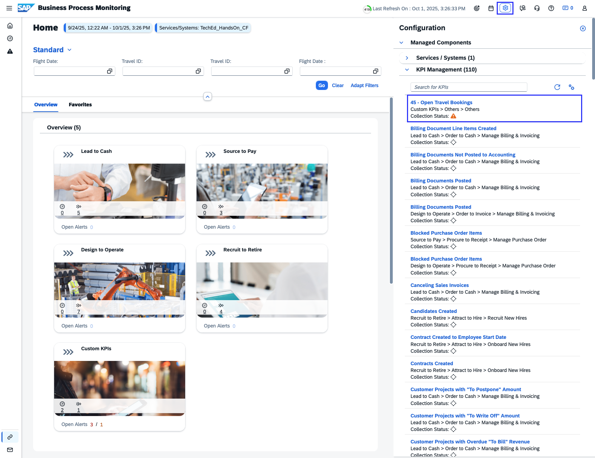

- Click on the KPI Name to configure the KPI
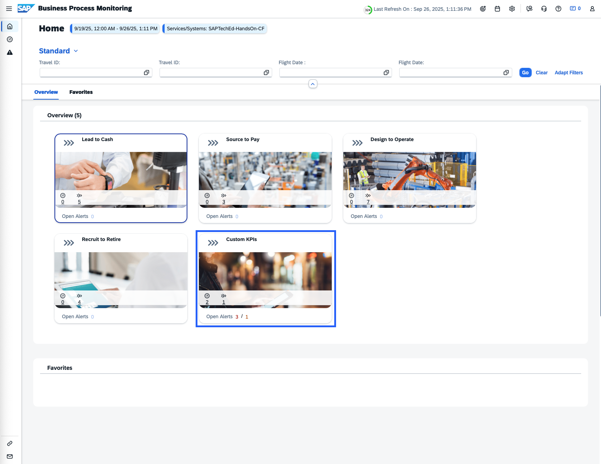

- Navigate to the 'Events' section and click on the 'Add' button
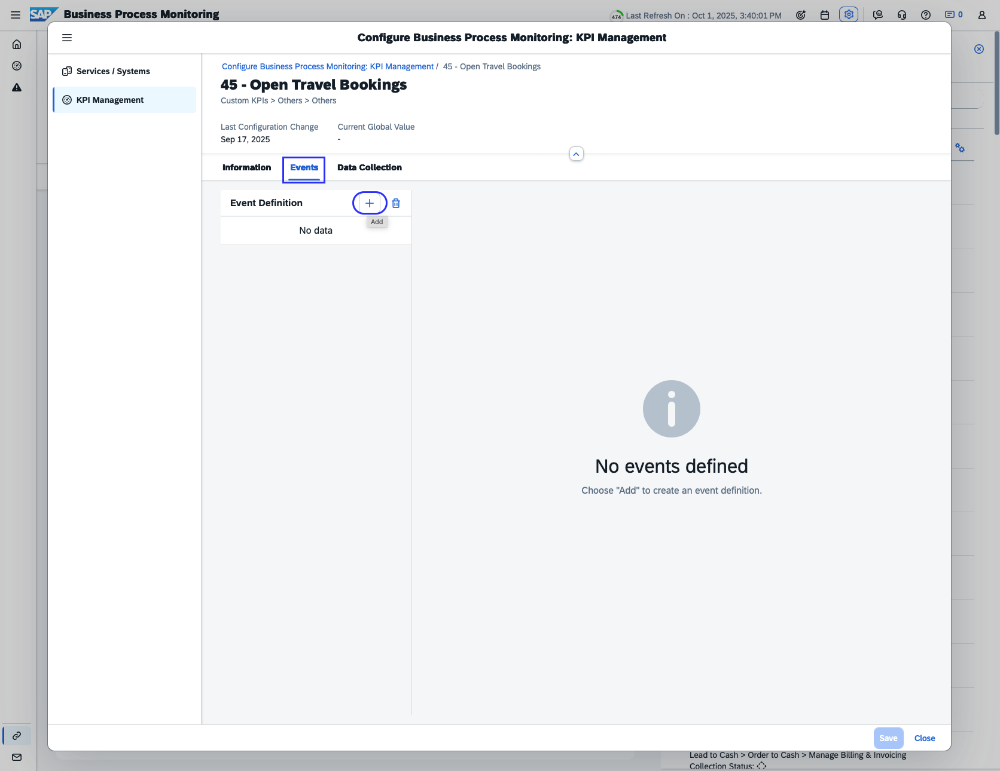

- Fill the mandatory fields. \
Choose threshold values for Warning and Critical alert \
In the 'Event Actions'section, Switch On 'Create Alert' \
Save the event
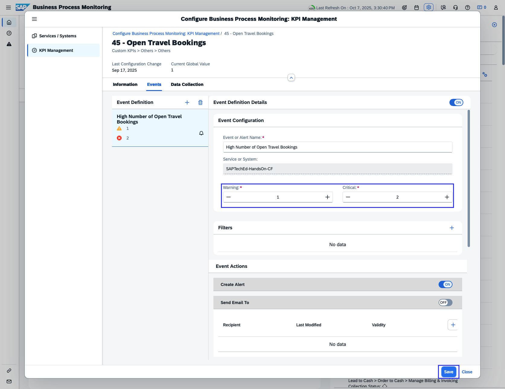

** lower thresholds  1, 2 **

## 4.4 [Optional] Add an Event with a filter (Guided Exercise)
- Navigate to the KPI created in the previous section

- Click on the KPI Name to configure the KPI
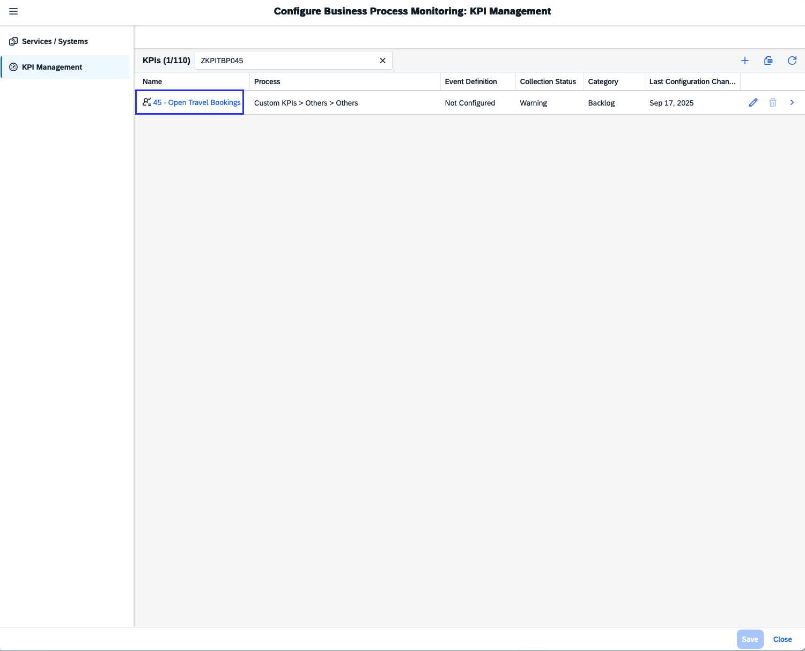

- Navigate to 'the Events' section and click on the 'Add' button

- Fill the mandatory fields. \
Choose threshold values for the Warning and Critical alerts 

- Click on 'Add' in the filters section \
Select 'Destination City' is 'Hamburg'
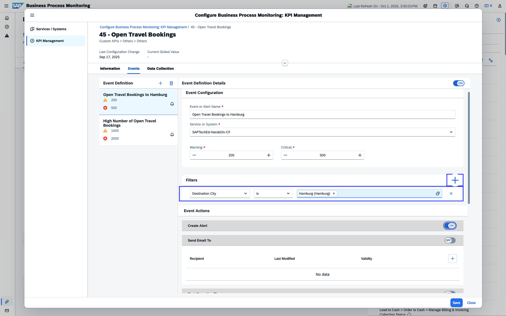

- **Hint** Use Value Help to search for filter values 
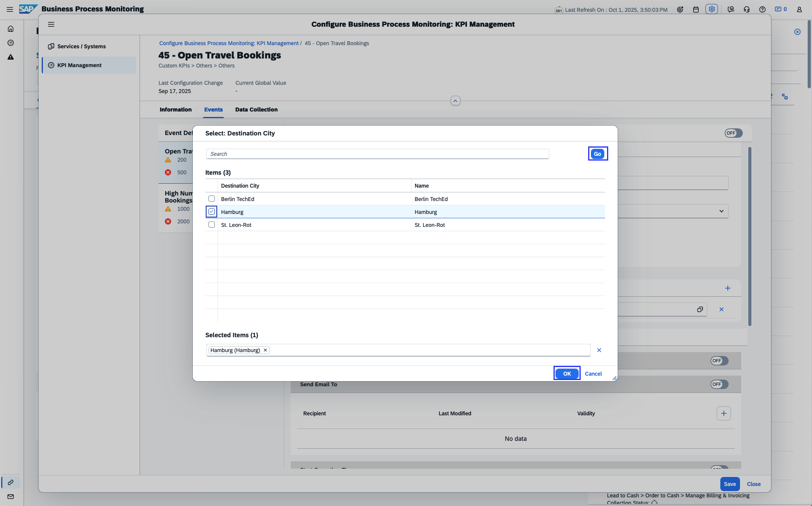

## 4.5 Adjust Graph and work with Views (Guided Exercise)

...

## 4.6 Explore Guided Tours (Guided Exercise)

**Additional Links**\
[Business process Monitoring Overview](/exercises/ex4/4_BusinessProcessMonitoring_Base.md)\
[Return to Session Overview](/README.md#overview)

**** link to Thank you page & feedback?

