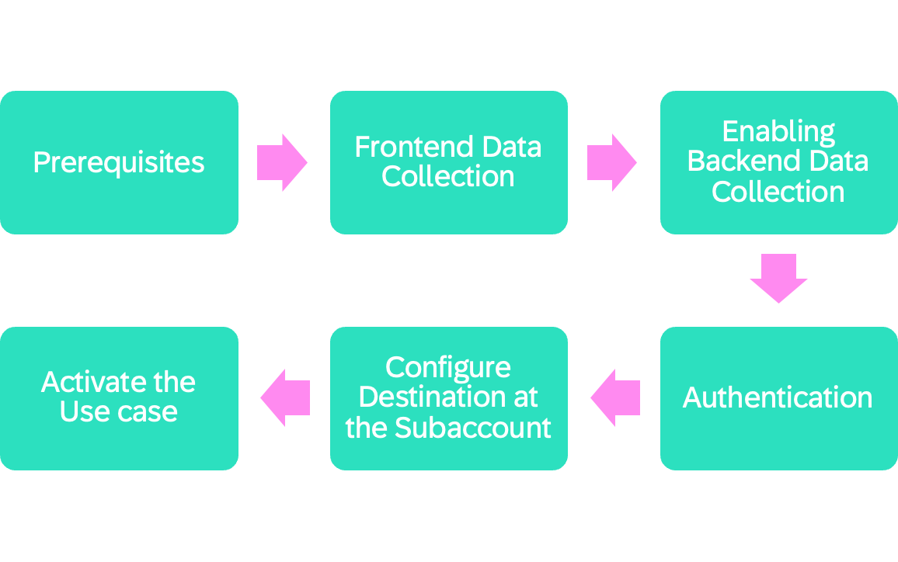
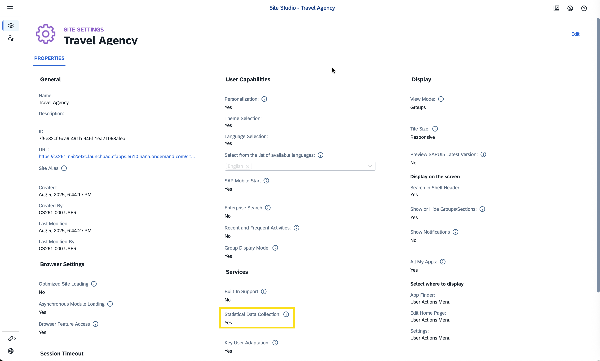
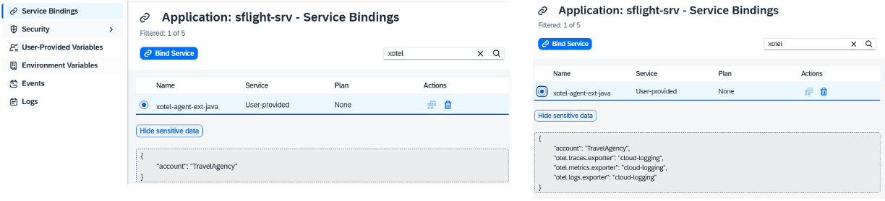
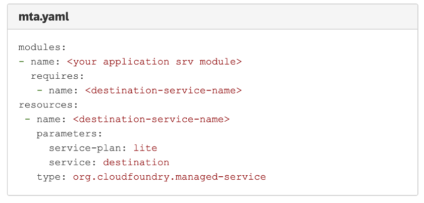
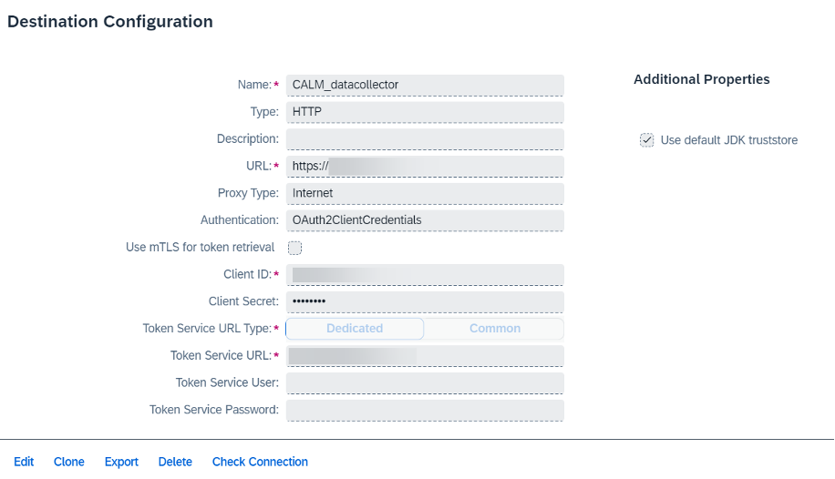
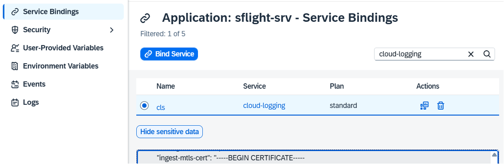
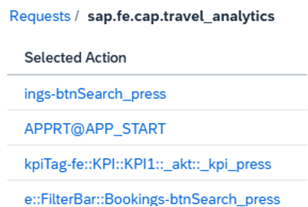
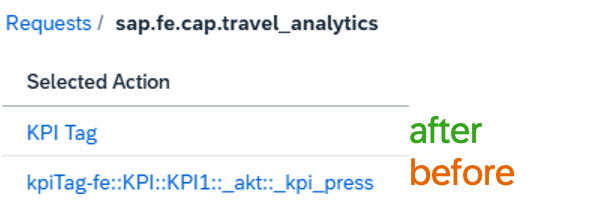

# Additional Information

In preparation for this session we instrumented the application and prepared the landscape follwing this flow:



## Prerequisites

- Required Java version: Runtime needs to be Java 11, Java 17 or Java 21
- Prerequisites for custom instrumentation or SAP Java Buildpack is not being used
    - Required library versions*
        - otel-agent-ext-java: Version 1.5.30
        - calm-crun-client-api-java*: Version 1.5.32 (optional, only required for custom instrumentation)
        - fesr-to-otel-java: Version 2.0.26 (for Spring Boot 3)
    -  artifactory as repository in pom.xml
    - Update settings.xml pointing to technical user credentials for the artifactory

* Make sure to use the latest versions / keep your apps updated

[Prerequisites [SAP Cloud ALM Expert Portal - OpenTelemetry@SAP]](https://support.sap.com/en/alm/sap-cloud-alm/operations/expert-portal/data-collection-infrastructure.html?anchorId=section_415688568#section_415688568) 

## Frontend Data Collection

We embedded our application into SAP Build Workzone Launchpad and switched on the colleciton of statistical data records for the site. 



In case you are not using SAP Build Workzone you can instrument a front end receiver into your application. The relevant steps can be found on our Expert Portal:

[Enabling Frontend Data Collection [SAP Cloud ALM Expert Portal - OpenTelemetry@SAP]](https://support.sap.com/en/alm/sap-cloud-alm/operations/expert-portal/data-collection-infrastructure.html?anchorId=section_873338493#section_873338493)

## Enabling Backend Data Collection

- To configure the data collection instrumentation for back-end services you only need the respective auto-instrumentation:
    - [Autoinstrumentation for Java](https://support.sap.com/en/alm/sap-cloud-alm/operations/expert-portal/data-collection-infrastructure/autoinstrumentation-for-java.html)
    - [Autoinstrumentation for Node.js](https://support.sap.com/en/alm/sap-cloud-alm/operations/expert-portal/data-collection-infrastructure/autoinstrumentation-nodejs.html)
- SAP Java Build Pack Setup (without or with Cloud Logging)



Further information:
[Enabling Backend Data Collection [SAP Cloud ALM Expert Portal - OpenTelemetry@SAP]](https://support.sap.com/en/alm/sap-cloud-alm/operations/expert-portal/data-collection-infrastructure.html?anchorId=section_1199289189_c)

## Authentication

- In order to export towards SAP Cloud ALM you have to setup the destination via
    - OAuth based authentication
    - Bind to Destination Service
- Add the below lines to mta.yaml



## Configure Destination at the Subaccount

- Create a destination configuration using Destination Service for persisting the base URL and retrieving it



- The Destination must be named 'CALM_datacollector' and created at the provider subaccount level

- SAP Cloud ALM data push endpoints will be formed dynamically by retrieving the base URL from the Destination.

Further information:
[Configure Destination at the Subaccount [SAP Cloud ALM Expert Portal - OpenTelemetry@SAP]](https://support.sap.com/en/alm/sap-cloud-alm/operations/expert-portal/data-collection-infrastructure.html?anchorId=section_1763544621)

## Activate the Use Case

After you have done the instrumentation as described above, you may do the final activation in the respective use cases:

- [Business Process Monitoring](https://support.sap.com/en/alm/sap-cloud-alm/operations/expert-portal/business-process-monitoring/custom-kpis.html) (supported for Java and Node.js)
- [Exception Monitoring](https://support.sap.com/en/alm/sap-cloud-alm/operations/expert-portal/integration-monitoring/calm-cp-cf.html?anchorId=section_2066589932) (supported for Java and Node.js)
- [Health Monitoring](https://support.sap.com/en/alm/sap-cloud-alm/operations/expert-portal/health-monitoring/health-monitoring-setup-configuration/health-monitoring-for-sap-btp-cf.html) (supported for Java and Node.js)
- [Job & Automation Monitoring](https://support.sap.com/en/alm/sap-cloud-alm/operations/expert-portal/job-monitoring/job-automation-monitoring-details.html?anchorId=section_2060785628) ([SAP Job Scheduler Service](https://help.sap.com/docs/job-scheduling/sap-job-scheduling-service/using-sap-job-scheduling-service?version=Cloud) jobs in Java and Node.js)
- [Real User Monitoring](https://support.sap.com/en/alm/sap-cloud-alm/operations/expert-portal/real-user-monitoring/run-details/rum-setp-btp-cf.html?anchorId=section_1350755031) (supported for Java and Node.js)

## SAP Cloud Logging Snippets

- Configuration of Cloud Logging Instance: [SAP Help Portal](https://help.sap.com/docs/cloud-logging/cloud-logging/ingest-via-opentelemetry-api-endpoint?version=Cloud)
- Service binding to either dedicated cloud-logging service instance (screenshot below) or to a user-provided service (tagged with label “Cloud Logging”)
 

# Additional Hints

# Custom naming of UI5 actions

By default UI5 action names are rather technical, e.g.



But developers can map technical names to human readable names using the FESRHelper:

```
import Element from "sap/ui/core/Element";
import FESRHelper from "sap/ui/performance/trace/FESRHelper";
// …
const kpiTag = Element.getElementById("sap.fe.cap.travel_analytics::BookingsList--kpiTag-fe::KPI::KPI1::_akt::_kpi");
FESRHelper.setSemanticStepname(kpiTag, "press", "KPI Tag"); // max. 20 characters
```



