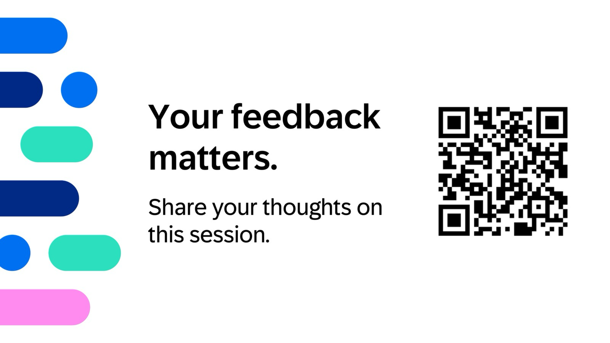

# 🎉 Thank You!

**A huge THANK YOU for joining us today!** We hope you had as much fun learning as we did in preparing and delivering it! 🤗
Today, we covered a lot of ground, and you should be proud of the skills you've gained. Remember, every expert was once a beginner, and you're well on your way!  
You showed up, rolled up your sleeves, and turned ideas into working bits and bytes. High-fives all around! 🙌

## What We Built Together 🚀

- Health Monitoring
- Exception and Integration Monitoring
- Real User Monitoring
- Business Process Monitoring
- Synthetic User Monitoring

## Further Readings 🧭

Check out our Expert Portal for further reading:
[SAP Cloud ALM for Operations - Expert Portal](https://support.sap.com/en/alm/sap-cloud-alm/operations/expert-portal.html)

## Need Help? 🤝

Contact our general inbox to reach out us:
- Email: [cloudalm@sap.com](mailto:cloudalm@sap.com)  

## We Want Your Feedback 🗣️

Tell us what worked, what didn’t, and what you’d love to see next time:  

## Shout‑Outs 🙏

Huge thanks to our facilitators, co-hosts, and the involved colleagues who made this session possible.  
And to you—for asking great questions, testing limits, and making it fun!

## See You Soon 👋

Keep building, keep experimenting, keep shipping.  
Until next time!!
